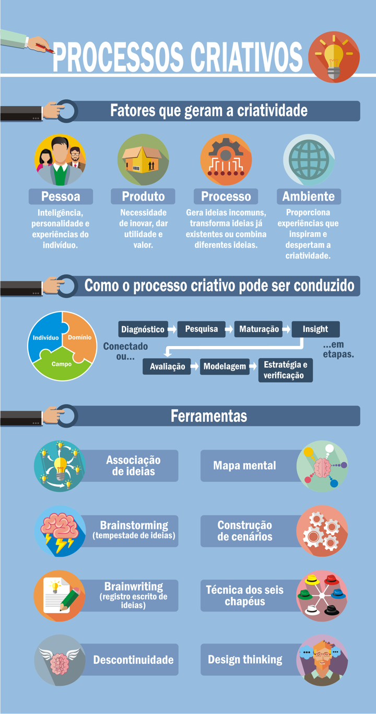
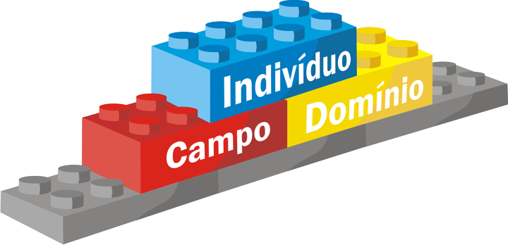
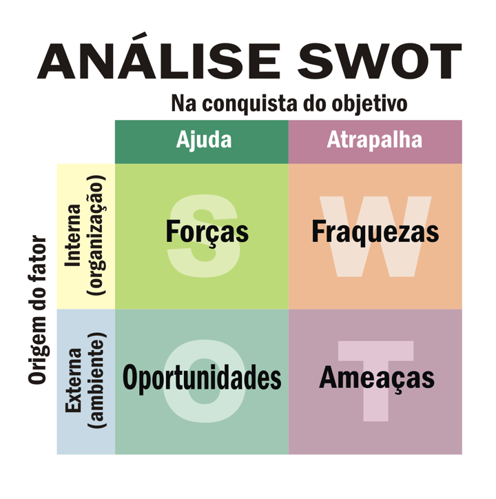
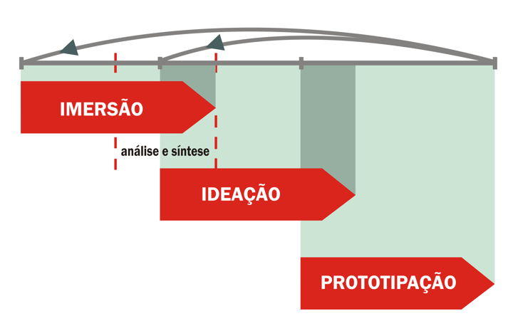

# Tema 2° - PROCESSOS CRIATIVOS

## Principais pontos abordados no tema

Os processos criativos são abordados como um tema nesta unidade. A criatividade, o pensamento criativo e os princípios do processo criativo são explorados, juntamente com as principais metodologias e técnicas utilizadas para estimular a criatividade no processo de inovação.

A criatividade é frequentemente associada ao pensamento original, novo e valioso. As pessoas muitas vezes dependem de modelos testados e comprovados, em vez de desenvolverem iniciativa e criatividade. No entanto, a competitividade atual leva as empresas a buscarem soluções inovadoras, o que requer o estímulo à criatividade dos colaboradores.

A criatividade é influenciada por diferentes aspectos, incluindo características cognitivas, traços de personalidade, experiências, ambiente e produtos finais úteis e valorosos para a sociedade. O pensamento criativo pode ser desenvolvido em um ambiente propício, como uma universidade, onde a curiosidade pode levar à criatividade e à geração de ideias inovadoras.

O processo criativo é descrito como um processo resultante da interação de três fatores: o indivíduo, o campo social e o domínio cultural. Esses fatores desempenham um papel na geração de variação e no desenvolvimento de ideias criativas. O processo criativo pode ser dividido em fases, como a percepção do problema, a captação de informações, a incubação, a iluminação, a avaliação, a elaboração e as estratégias de realização e verificação.

Existem várias ferramentas e técnicas que podem ser usadas para estimular a criatividade. Algumas dessas técnicas incluem a associação de ideias, o brainstorming (tempestade de ideias), o brainwriting (registro escrito de ideias), a descontinuidade, o mapa mental, a construção de cenários e a técnica dos seis chapéus. Essas técnicas podem ser aplicadas em diferentes contextos, como desenvolvimento de produtos, marketing, planejamento de pesquisa, entre outros, para promover a geração de novas ideias e soluções inovadoras.

É importante ressaltar que a criatividade pode ser desenvolvida por qualquer pessoa por meio da aplicação dessas técnicas e da criação de um ambiente propício à livre expressão de ideias e ao pensamento criativo.

## O pensamento criativo

### Pessoa

incluem três aspectos: características cognitivas, traços de personalidade e experiências (ter hobby ou ter um primeiro filho).

### Produto

enfatizam que o produto final deve ser novo, útil e com valor para a sociedade.

### Processo

acreditam que o desenvolvimento de produtos criativos passa por um processo que envolve uma maneira original para a produção de ideias incomuns, transformações de ideias já existentes ou uma combinação diferente de ideias.

### Ambiente

a pesquisa objetiva em criatividade, aponta que “nenhuma pessoa criativa consegue avançar sem experiências ou fatos prévios ocorridos em diversos ambientes; ninguém cria no vazio ou com o vazio” (GUILFORD, 1950, p.448 citado por LINS; MYATA, 2008, p.459).

## O processo criativo

### Indivíduo

Carga genética e experiências pessoais – seu papel no processo consiste em gerar variação pela motivação proveniente da apropriação de conhecimentos e características de personalidade;

### Campo

Sistema social – representado por um conjunto de especialistas que se encarregam de julgar, premiar ou desencorajar pessoas, alicerçados em fatores econômicos, técnicos e logísticos presente em sua época.

### Domínio

Cultura – consiste na parte simbólica que integra necessidades, retém informações e modela comportamentos para as próximas gerações.

## Fases do processo criativo

### Percepção do Problema

Captação de um problema aberto, ou seja, onde existem diversas respostas possíveis. A formulação do problema deve ser o mais claro possível, para que a tarefa seja bem conduzida.

### Captação das Informações

Busca de informações, multidirecional, significativa, ou irrestrita, pois não se sabe que informação ou estímulo podem levar ao surgimento de uma resposta adequada.

### Incubação

Nessa fase todo o material recolhido vai ser submetido a um Processo inconsciente de trabalho, trata-se da fazer de reflexão e maturação das informações adquiridas. Reflexão, contemplação, maturação e apropriação.

### Iluminação

É o momento privilegiado em que uma ideia ou imagem emerge do inconsciente e traz uma resposta possível ao problema, também pode ser entendido como a fase insight.

### Avaliação

Analisa-se a ideia, confronta-se com os critérios previamente definidos que delimitam e especificam as condições a cumprir. Momento de verificar se a ideia reúne os pré-requisitos necessários para dar solução ao problema diagnosticado.

### Elaboração

Detalha-se a melhor ideia, previamente avaliada, em uma solução possível com o máximo de detalhes. Consiste na aplicação dos conhecimentos técnicos, procedimentais e metodológicos com vistas a realizar as conexões necessárias para torná-la tangível ou aplicável da ideia.

### Estratégias de realização e verificação

Elabora-se o plano ou projeto para a realização da ideia: procura-se aliados, formas de apresentação, momentos e lugares oportunos, previsão de críticas, compara-se, estrutura-se para a execução. A ideia projetada, planificada para ser, posteriormente, realizada.

## Como desenvolver um mapa mental:

- Escreva o tema central no centro de uma folha;
- Desenhe diversas linhas a partir dele e escreva nos seus extremos palavras-chave que representem benefícios, objetivos, técnicas, princípios, desenvolvimento, dentre outros.
- Deixe a mente fluir livremente e então vá estabelecendo as conexões entre as ideias.
- Por fim, analise as conexões criadas.

## Técnica dos seis chapéus

### Branco:

Olha para os fatos, não fazendo julgamentos.

### Vermelho:

Utilizado para expressar sentimentos e dar respostas intuitivas.

### Preto:

O chapéu mais negativo é utilizado para examinar obstáculos e as razões por que determinada decisão não deu certo.

### Amarelo:

Representa o pensamento otimista, que procura os benefícios de um projeto.

### Verde:

Utilizado para o pensamento mais criativo, é o chapéu das alternativas, das ideias provocadoras e da mudança.

### Azul:

É o chapéu da reflexão, que o ajuda, por exemplo, a identificar o chapéu que terá que usar em cada momento.

## Reflita:

#### Quais as características que devemos desenvolver para ser um design Thinker?

- Ter um senso crítico e ser flexível com mudanças;
- Ter empatia pelas atitudes e comportamentos das pessoas;
- Ser paciente para permanecer em um ambiente hostil cheio de problemas, até que as perguntas certas possam surgir;
- Consideração pelo colaborativo, aproximar-se do problema tanto da empresa quanto de seu cliente final.

## Imagens

## Referências

- [https://sites.google.com/ulbra.br/G000004GS003/t002](https://sites.google.com/ulbra.br/G000004GS003/t002)
