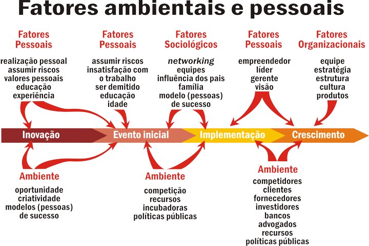
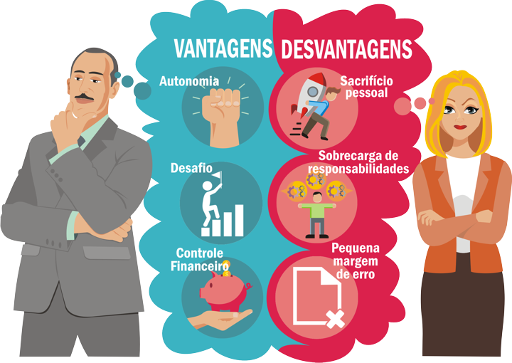

# Tema 2° - O EMPREENDEDORISMO TRANSFORMA REALIDADES

## Principais pontos abordados no tema

- O artigo aborda os principais conceitos e características do empreendedorismo.
- São apresentadas as diferenças entre empreender e ser um empresário.
- O perfil do empreendedor de sucesso é delineado, destacando a importância da oportunidade e da criatividade na geração de ideias.
- São explorados os principais modelos de empreendedorismo, suas vantagens e desvantagens, bem como os tipos existentes de empreendedorismo.
- É abordada a importância de ter um modelo de negócios pré-estabelecido e bem definido, incluindo o modelo Canvas e a elaboração de um plano de negócios eficiente.
- São apresentados métodos de avaliação de negócios, como o método de fluxo de caixa descontado, avaliação por fluxos e avaliação por valor patrimonial.
- É discutida a evolução do conceito de empreendedorismo ao longo do tempo, destacando o papel das inovações tecnológicas.
- São mencionados empreendedores famosos, como Bill Gates e Henry Ford, que colocaram a tecnologia como ponto central de seus empreendimentos.
- É destacada a alta taxa de atividade empreendedora no Brasil, de acordo com a pesquisa GEM - Global Entrepreneurship Monitor.
- São apresentados os principais fatores que influenciam o processo empreendedor, incluindo fatores pessoais, sociológicos, ambientais e organizacionais.
- São descritas as características do empreendedor, como iniciativa, visão, coragem, decisão, entre outros.
- São apresentados os tipos de empreendedorismo, como empreendedorismo corporativo, empreendedorismo de startup, empreendedorismo de negócios e empreendedorismo social.
- É explicada a importância dos modelos de negócios, como o Canvas e o plano de negócios, e são abordados métodos de avaliação de negócios.

## Modelos de Negócios

### Pensamento visual

Estimular as ideias e interação através do uso de imagens, infográficos, rascunhos, diagramas, comunicação etc, mais conhecido como visual thinking.

### Visão sistêmica

Possuir a capacidade de tomar decisões importantes através de uma dinâmica de olhar o todo, entender o cenário, captar as informações que ambiente está oferecendo e construir soluções práticas para os negócios.

### Cocriação

Utilizar a participação dos stakeholders no processo de criação. Clientes, empresas, startups, estudantes, comunidade, passaram a ter um papel fundamental na elaboração de ideias e criação de empresas e novos negócios. O Waze, aplicativo de verificação do trânsito em tempo real vem utilizando a técnica do crowsourcing, que nada mais é que utilizar da interação do público para melhorar seus projeto, recebendo informações importantes sobre o trânsito e atualizando tais informações para outros usuários do aplicativo.

### Simplicidade e aplicabilidade

Dar foco ao processo de criação, achar o alvo para determinada criação, trazendo a percepção de gaps no processo.

## Reflita:

### Como vou criar uma empresa inovadora? Como vou agregar valor ao meu produto ou serviço? Como vou quebrar as barreiras de um negócio ultrapassado?

Essas e outras perguntas são inevitáveis quando se utiliza a ferramenta do Canvas no processo de criação e inovação.

Quais despesas teremos e qual meta financeira pretendo atingir? Tais questionamentos serão respondidos a partir do momento que o modelo for definido. Abordaremos agora sobre o modelo criado por Alex Osterwalder, os 9 blocos construtivos do modelo de negócios.

## Plano de Negócios

### Plano de negócios Completo

É utilizado quando se pleiteia uma grande quantidade de dinheiro ou quando se necessita apresentar uma visão completa do seu negócio.

### Plano de Negócios Resumido

É utilizado quando se necessita apresentar informações resumidas a um investidor, por exemplo, com o objetivo de chamar sua atenção para que ele lhe requisite um plano de negócios completo.

### Plano de Negócios Operacional

é muito importante para ser utilizado internamente na empresa pelos diretores, gerentes e funcionários. É excelente para alinhar os esforços internos em direção aos objetivos estratégicos da organização. O uso de softwares é muito comum para a criação de alguns desses planos, porém é mais difícil de serem adaptados, mas existem diversos benefícios de se utilizar as ferramentas tecnológicas na elaboração de um bom plano.

## Imagens

## Referências

- [https://sites.google.com/ulbra.br/G000004GS003/t004](https://sites.google.com/ulbra.br/G000004GS003/t004)
