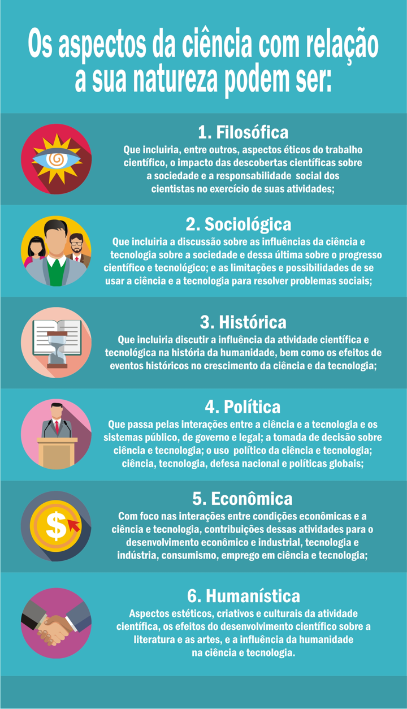
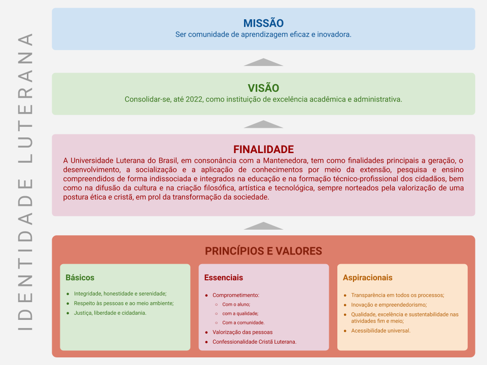
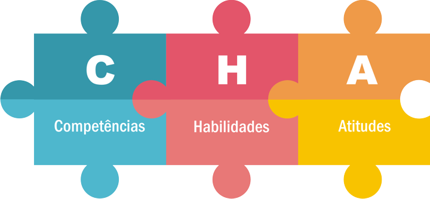
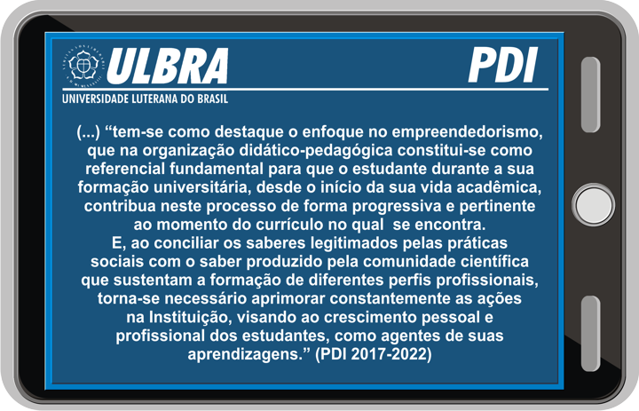
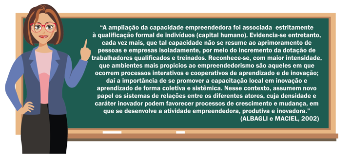

# Tema 1° - CONTEXTUALIZANDO CIÊNCIA, INOVAÇÃO E EMPREENDEDORISMO

Nesta unidade temática, você vai aprender sobre a importância da Ciência e da instituição de ensino para a sociedade, a importância da Inovação para o desenvolvimento do país e a importância do Empreendedorismo para o crescimento da economia.

A ciência é fundamental para o avanço do conhecimento em diversas áreas do saber, não se restringindo apenas às ciências exatas. Ela envolve o exame sistemático e cuidadoso dos temas relacionados ao ser humano e à sociedade. A ciência busca conhecimento confiável e objetivo, baseado em métodos específicos e na análise de dados e evidências, evitando opiniões pessoais e preconceitos.

A ULBRA, instituição de ensino, valoriza a importância da ciência em todas as áreas do conhecimento, conforme proposto em seu Plano de Desenvolvimento Pedagógico (PDI). A universidade busca formar profissionais comprometidos eticamente com a sociedade, desenvolvendo competências cognitivas, técnicas, pessoais e sociais necessárias para uma atuação profissional transformadora.

A inovação é essencial em um cenário cada vez mais competitivo e globalizado. Ela não é um assunto recente e seu conceito vem sendo estudado e explorado desde o início do século XX. A inovação envolve a mobilização e coordenação de recursos e capacidades, internos e externos à empresa, para neutralizar ameaças e explorar oportunidades alinhadas às prioridades estratégicas da empresa. A inovação não se limita apenas à melhoria da produção de grandes empresas, mas também está presente em diferentes áreas, como inovações sociais, na saúde, no poder público, nas tecnologias de comunicação, entre outras.

O empreendedorismo está relacionado ao conceito de inovação, pois o empreendedor é aquele que inova e é agente de mudanças. O empreendedorismo na universidade e na sociedade impulsiona a pesquisa científica e a geração de inovação. O empreendedor, interagindo com os demais, aproveita um ambiente propício ao empreendedorismo, propondo mudanças, implantando novas práticas e buscando oportunidades.

Em resumo, a ciência, a inovação e o empreendedorismo estão interligados e desempenham papéis fundamentais no processo de formação acadêmica, no desenvolvimento da sociedade e no crescimento da economia. A compreensão desses conceitos e sua aplicação prática são essenciais para a construção de uma sociedade que exerça seus direitos e deveres humanos, potencializando inovação e empreendedorismo em diferentes áreas do conhecimento.

## Imagens

## Referências

- [https://sites.google.com/ulbra.br/G000004GS003/t001](https://sites.google.com/ulbra.br/G000004GS003/t001)
