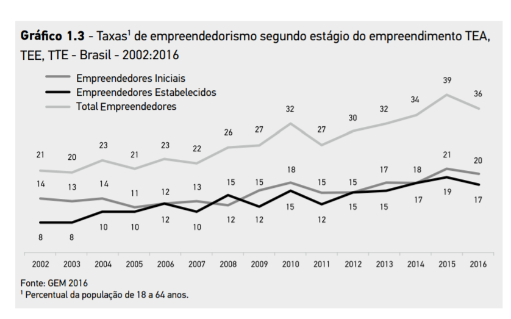

# Tema 4° - O EMPREENDEDORISMO TRANSFORMA REALIDADES

## Principais pontos abordados no tema

O texto apresenta uma introdução ao empreendedorismo, abordando os principais conceitos, características do comportamento empreendedor e modelos de negócios. Ele destaca a importância de avaliar tendências e perspectivas de novos empreendimentos e conhecer as características dos empreendedores de sucesso.

Um dos principais pontos a serem abordados é a diferença entre empreender e se tornar um empresário. Nem todo empresário é empreendedor, pois ser empreendedor envolve mais do que apenas criar uma empresa, mas também buscar oportunidades e utilizar a tecnologia e a inovação a favor dos negócios.

Ao longo da história, várias invenções e revoluções tecnológicas surgiram em momentos propícios, impulsionando o papel do empreendedorismo. Exemplos notáveis incluem a Revolução Industrial, a criação do telefone, do computador pessoal e da lâmpada elétrica, que transformaram a forma como produzimos, criamos e nos relacionamos.

No que diz respeito aos modelos de negócios, o texto menciona o modelo CANVAS, que é uma estrutura visual e flexível para a criação de um novo negócio. Também destaca a importância de um plano de negócios bem definido para o processo de criação e implementação. Além disso, são apresentados três métodos de avaliação de negócios: Método de fluxo de caixa descontado, Método de avaliação por fluxos e Método de avaliação por valor patrimonial.

O texto enfatiza que o empreendedorismo está relacionado à inovação, ao uso da tecnologia e à capacidade de assumir riscos. Também ressalta a diferença entre ser empresário e ser empreendedor, destacando que nem todo empresário possui as características empreendedoras. São mencionados exemplos de empreendedores de sucesso, como Bill Gates e Henry Ford.

Quanto ao perfil dos empreendedores, são destacadas características como iniciativa, visão, coragem, firmeza, decisão, capacidade de organização e direção. São apresentadas as três características básicas do empreendedor: necessidade de realização, disposição para assumir riscos e autoconfiança. Também são mencionados outros traços de comportamento do empreendedor, como criatividade, otimismo, perseverança, senso de independência e capacidade de implementação.

O texto também aborda os tipos de empreendedorismo, mencionando o empreendedorismo corporativo, o empreendedorismo de start-up, o empreendedorismo de negócios e o empreendedorismo social. Cada um desses tipos possui características e objetivos específicos.

Em resumo, o texto destaca a importância do empreendedorismo como um meio de transformar realidades, apresentando conceitos, características e modelos relacionados ao empreendedorismo.

## Tipos de empreendedorismo

1. Empreendedorismo corporativo: relacionado às atividades inovadoras dentro de empresas estabelecidas, buscando desenvolvimento e implementação de novos focos de mercado.
2. Empreendedorismo de Start-Up: envolve empresas com ideias inovadoras e estratégias diferentes para entrar no mercado.
3. Empreendedorismo de negócios: focado no desenvolvimento de novas empresas, abertura de franquias e ideias inovadoras que se tornam negócios lucrativos.
4. Empreendedorismo social: visa criar mudanças e valor social, não apenas inovação comercial. Envolve parcerias entre empresas privadas, organizações públicas e organizações do terceiro setor.

## Modelos de Negócios

### Pensamento visual

Estimular as ideias e interação através do uso de imagens, infográficos, rascunhos, diagramas, comunicação etc, mais conhecido como visual thinking.

### Visão sistêmica

Possuir a capacidade de tomar decisões importantes através de uma dinâmica de olhar o todo, entender o cenário, captar as informações que ambiente está oferecendo e construir soluções práticas para os negócios.

### Cocriação

Utilizar a participação dos stakeholders no processo de criação. Clientes, empresas, startups, estudantes, comunidade, passaram a ter um papel fundamental na elaboração de ideias e criação de empresas e novos negócios. O Waze, aplicativo de verificação do trânsito em tempo real vem utilizando a técnica do crowsourcing, que nada mais é que utilizar da interação do público para melhorar seus projeto, recebendo informações importantes sobre o trânsito e atualizando tais informações para outros usuários do aplicativo.

### Simplicidade e aplicabilidade

Dar foco ao processo de criação, achar o alvo para determinada criação, trazendo a percepção de gaps no processo.

## Reflita:

### Como vou criar uma empresa inovadora? Como vou agregar valor ao meu produto ou serviço? Como vou quebrar as barreiras de um negócio ultrapassado?

Essas e outras perguntas são inevitáveis quando se utiliza a ferramenta do Canvas no processo de criação e inovação.

Quais despesas teremos e qual meta financeira pretendo atingir? Tais questionamentos serão respondidos a partir do momento que o modelo for definido. Abordaremos agora sobre o modelo criado por Alex Osterwalder, os 9 blocos construtivos do modelo de negócios.

## Plano de Negócios

### Plano de negócios Completo

É utilizado quando se pleiteia uma grande quantidade de dinheiro ou quando se necessita apresentar uma visão completa do seu negócio.

### Plano de Negócios Resumido

É utilizado quando se necessita apresentar informações resumidas a um investidor, por exemplo, com o objetivo de chamar sua atenção para que ele lhe requisite um plano de negócios completo.

### Plano de Negócios Operacional

é muito importante para ser utilizado internamente na empresa pelos diretores, gerentes e funcionários. É excelente para alinhar os esforços internos em direção aos objetivos estratégicos da organização. O uso de softwares é muito comum para a criação de alguns desses planos, porém é mais difícil de serem adaptados, mas existem diversos benefícios de se utilizar as ferramentas tecnológicas na elaboração de um bom plano.

## Imagens

## Referências

- [https://sites.google.com/ulbra.br/G000004GS003/t004](https://sites.google.com/ulbra.br/G000004GS003/t004)
