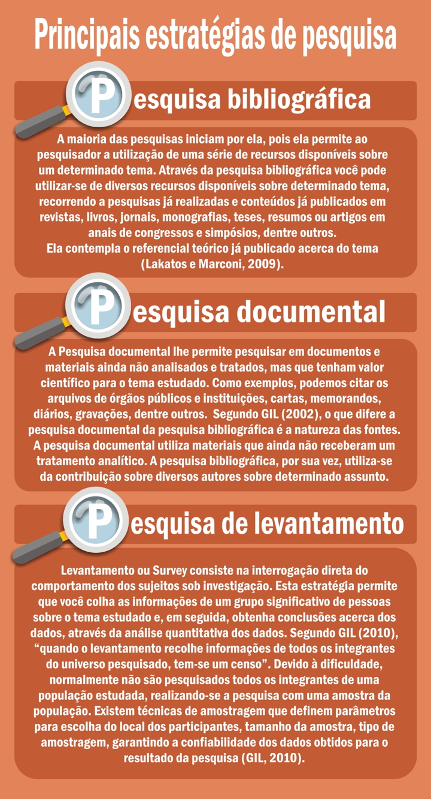
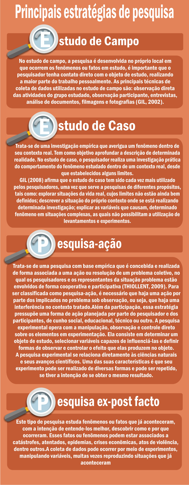
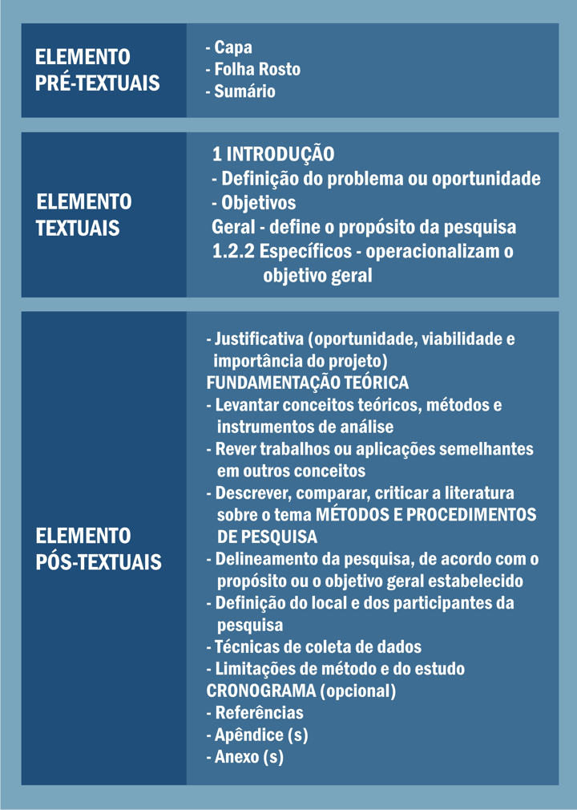

# Tema 5° - A IMPORTÂNCIA DA CIÊNCIA E DA PESQUISA CIENTÍFICA

A ciência e a pesquisa científica desempenham um papel fundamental no avanço do conhecimento e no desenvolvimento da sociedade. A ciência é um conjunto de saberes que se baseia na associação de experiências práticas com o raciocínio lógico, utilizando observação, identificação, descrição e investigação experimental, além da aplicação de teorias.

No entanto, a ciência não busca estabelecer verdades absolutas, mas sim verdades provisórias que facilitam a compreensão da realidade atual e permitem prever eventos futuros. A ciência está em constante evolução, com novos conhecimentos sendo agregados e perspectivas ampliadas.

Na universidade, os professores elaboram projetos de pesquisa e extensão nos quais os alunos podem participar, através da iniciação científica. Esses projetos permitem aos alunos estudar temas mais aprofundados, não abordados em sala de aula, e ter o primeiro contato com o método científico.

O conhecimento científico é objetivo, racional, sistemático, geral, verificável e reconhece a possibilidade de erro. É baseado em observações e experimentações que visam comprovar ou refutar teorias. O conhecimento científico é uma forma aprimorada do senso comum, obtido por meio da investigação científica.

A pesquisa científica é um conjunto de atividades orientadas para a busca de conhecimento. Distingue-se da pesquisa comum por seu caráter investigativo e questionador, envolvendo observação, análise, reflexão crítica, síntese e aprofundamento de conceitos com base no método científico. A pesquisa científica baseia-se na formulação de problemas e na busca de respostas, gerando novos questionamentos ao longo do processo.

Existem diferentes tipos de pesquisa científica, como pesquisa pura (básica) e pesquisa aplicada, cada uma com seus objetivos específicos. A pesquisa científica requer o uso de técnicas e procedimentos adequados, bem como a escolha de estratégias de pesquisa e técnicas de coleta e análise de dados apropriadas.

As técnicas de pesquisa são conjuntos de regras, normas ou protocolos utilizados para obter resultados em diferentes áreas, enquanto os procedimentos são as ferramentas específicas utilizadas para realizar a pesquisa. A escolha da estratégia de pesquisa e das técnicas de coleta e análise de dados depende do tipo e da natureza da pesquisa.

Algumas técnicas de pesquisa incluem observação, entrevistas, questionários, análise de conteúdo, análise de discurso, análise documental e análise matemática ou estatística. Cada uma dessas técnicas é adequada para tratar diferentes tipos de dados e permite uma análise sistemática e objetiva.

Em resumo, a ciência e a pesquisa científica são fundamentais para o avanço do conhecimento, a compreensão da realidade e o desenvolvimento da sociedade. A pesquisa científica baseia-se na formulação de problemas, utiliza o método científico e emprega diversas técnicas e procedimentos para coletar e analisar dados.

## Conhecimento científico

### Objetivo

Descreve a realidade, independente da opinião do pesquisador.

### Racional

Baseia-se na razão e não em sensações ou impressões para chegar aos resultados.

### Sistemático

Preocupa-se com a construção de um sistema de ideias, organizadas racionalmente, e em incluir conceitos parciais em totalidades cada vez mais amplas.

### Geral

Possui a preocupação com a elaboração de leis ou normas gerais, as quais explicam todos os fenômenos de certo tipo.

### Verificável

Apresenta sempre a possibilidade de demonstrar a veracidade das informações apresentadas.

### Falível

Reconhece a própria capacidade de errar.

## Técnicas de análise de dados

### Análise de conteúdo

Trata-se de um conjunto de técnicas de análise de comunicações, as quais utilizam procedimentos sistemáticos e objetivos de descrição do conteúdo das mensagens. Elas atuam na busca e geração de indicadores, tanto quantitativos quanto qualitativos, que permitam a inferência dos conhecimentos relativos às condições de produção e recepção da mensagem (AZEVEDO; MACHADO; SILVA, 2011).

### Análise de discurso

Esta técnica reúne a linguagem, o indivíduo e uma situação e/ou contexto. Pressupõe-se que, por meio da linguagem, os participantes da pesquisa comunicam-se e produzem um objeto (discurso) carregado de construções ideológicas. Ela focaliza a linguagem na forma como é utilizada em textos sociais, escritos ou falados, oriundos de entrevistas, respostas abertas de questionários, discussões de grupo e documentos.

### Análise documental

Esta técnica consiste em operações que têm como objetivo gerar uma nova forma de representação do conteúdo contido em documentos, com o objetivo de facilitar o acesso ao observador, de forma a obter o máximo de informação (aspecto quantitativo), com o máximo de pertinência (aspecto qualitativo).

### Análise matemática ou estatística

Por meio destas técnicas, os dados numéricos são analisados por meio de técnicas estatísticas, as quais podem ser descritivas, operando com quantidades, frequências e médias; comparativas, classificatórias etc. Os dados numéricos podem estar representados por valores numéricos, taxas, quantidades, ou ser oriundos de questões fechadas de questionários, convertidos para dados numéricos.

## Imagens

## Referências

- [https://sites.google.com/ulbra.br/G000004GS003/t005](https://sites.google.com/ulbra.br/G000004GS003/t005)
- [https://drive.google.com/file/d/1gM5LHa7gAhYGXS3FCdMubQUvzkYu_4cd/view](https://drive.google.com/file/d/1gM5LHa7gAhYGXS3FCdMubQUvzkYu_4cd/view)
- [https://drive.google.com/file/d/13uYTNzzZ9mWlRiuFn0UxYbM16WlNcKU1/view](https://drive.google.com/file/d/13uYTNzzZ9mWlRiuFn0UxYbM16WlNcKU1/view)
- [https://drive.google.com/file/d/1-K_hCnVWoxTmu-7c2Xz5x3TX88k7B2LQ/view](https://drive.google.com/file/d/1-K_hCnVWoxTmu-7c2Xz5x3TX88k7B2LQ/view)
