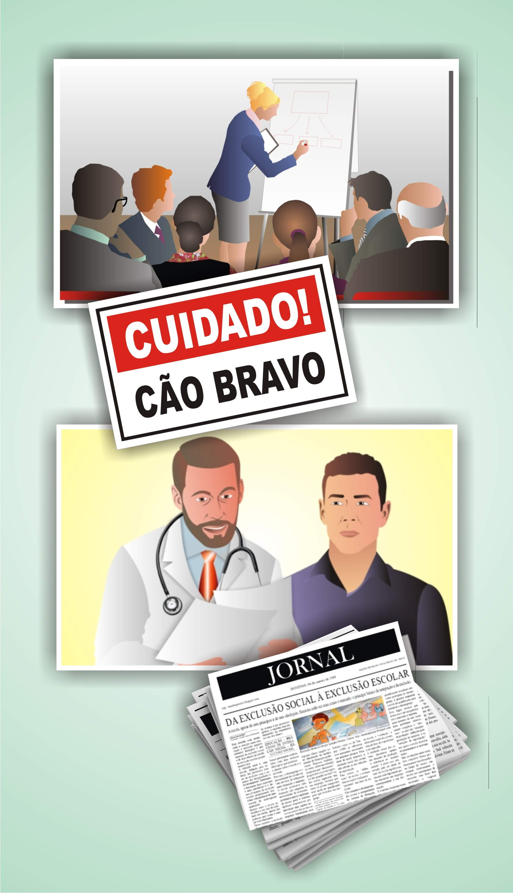
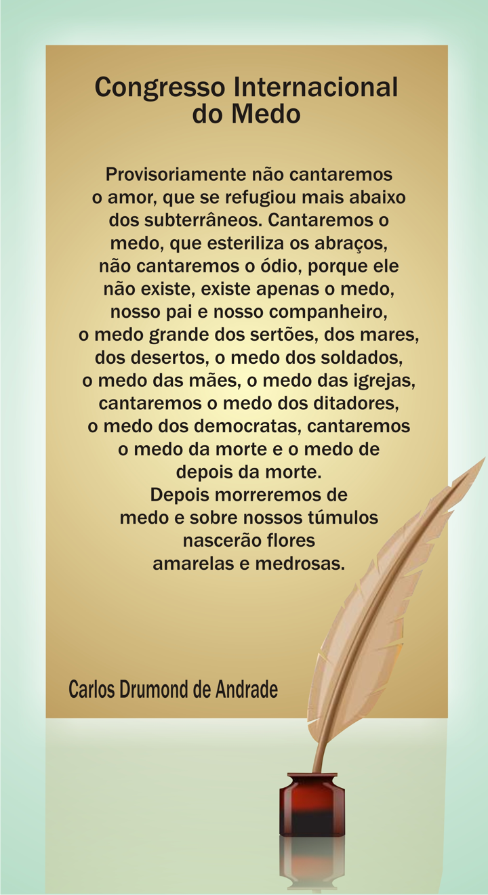
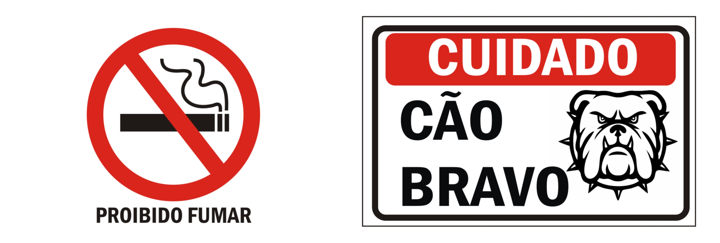
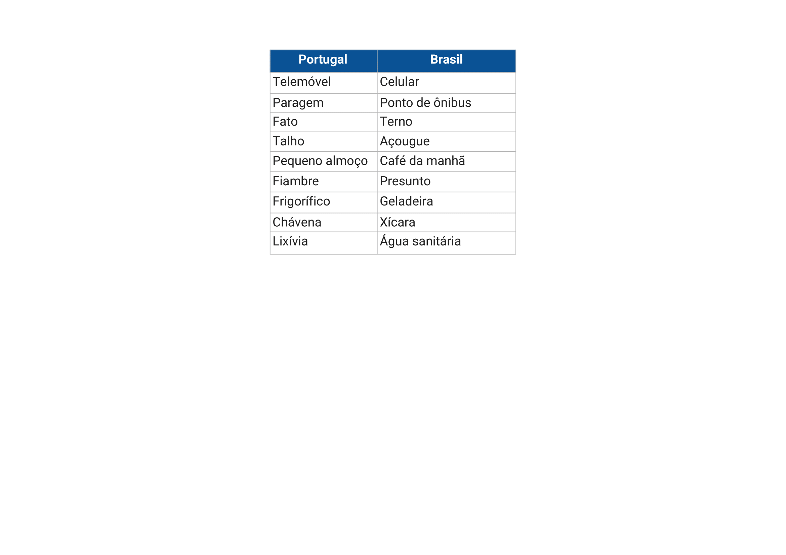
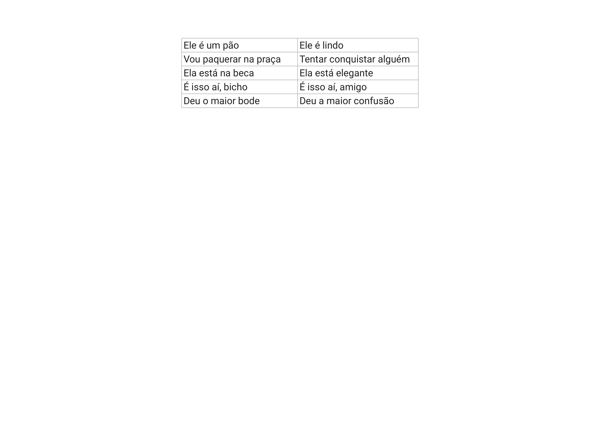

# Tema 1° - LINGUA, LINGUAGEM E AS DIFERENTES SITUAÇÕES SOCIOCOMUNICATIVAS

Nesta unidade temática, você aprenderá sobre língua, linguagem e as diferentes situações sociocomunicativas. O objetivo é desenvolver habilidades de leitura e interpretação de textos verbais e não verbais, além de promover o respeito e a compreensão das manifestações linguísticas da diversidade étnico-racial e cultural brasileira.

No início, o texto destaca a importância da comunicação e da linguagem na interação humana, no trabalho e na vida em sociedade. A linguagem é descrita como um fenômeno social que permite o relacionamento com as pessoas e o mundo ao nosso redor. A língua é apresentada como um dos meios mais utilizados para a comunicação e como uma forma de identificação cultural.

É ressaltado que todas as línguas vivas passam por mudanças ao longo do tempo, sendo um processo dinâmico e contínuo. Existem variações linguísticas decorrentes de fatores históricos, geográficos e socioculturais. A variação histórica ocorre ao comparar a língua em diferentes momentos do tempo, enquanto a variação geográfica refere-se às diferenças na pronúncia, vocabulário e estrutura sintática em diferentes regiões ou países. Já a variação social está relacionada à condição social, idade, gênero, uso de gírias e à influência da classe social e escolaridade.

A linguagem é dividida em verbal e não verbal. A linguagem verbal utiliza palavras escritas ou faladas para a comunicação e é amplamente utilizada em diversos contextos. Já a linguagem não verbal utiliza outros métodos de comunicação, como imagens, gestos, sons, expressões faciais, entre outros. A linguagem mista combina elementos da linguagem verbal e não verbal.

O texto enfatiza a interligação entre língua e fala, sendo a língua um fenômeno coletivo e a fala um ato individual. A variação linguística é abordada como uma característica natural da língua, influenciada por diversos fatores. São mencionadas as variações histórica, geográfica e social, evidenciando exemplos dessas variações em diferentes contextos.

É importante compreender que a língua é um sistema cultural e coletivo, enquanto a fala é individual. A variação linguística ocorre na fala, mas depende da língua para se estabelecer.

## Língua

Esta língua é como um elástico que espicharam pelo mundo.

No início era tensa, de tão clássica.

Com o tempo, se foi amaciando, foi-se tornando romântica, incorporando os termos nativos e amolecendo nas folhas de bananeira as expressões mais sisudas.

Um elástico que já não se pode mais trocar, de tão gasto; nem se arrebenta mais, de tão forte.

Um elástico assim como é a vida que nunca volta ao ponto de partida.

Gilberto Mendonça Teles.

## Variação social

### Gênero:

Homens e mulheres falam de forma distinta. Isso está relacionado ao condicionamento cultural dos papéis sociais definidos tanto para os homens quanto para as mulheres. Mulheres costumam usar mais o diminutivo e as partículas “né?”, “Tá?”, “Tá bom?”, chamados de marcadores conversacionais. Estes têm a função de obter a concordância de quem os ouve. Já a linguagem dos homens costuma ser mais marcada por palavrões, gírias e linguagem chula. Como essas variações são condicionadas pelos papéis sociais, elas podem, perfeitamente, ser diferentes de um contexto para o outro ou de uma geração para outra.

### Gíria:

As gírias pertencem ao vocabulário específico de certos grupos sociais, muito utilizadas pelas denominadas tribos urbanas, mas, assim como os jargões e termos técnicos, podem existir em qualquer ambiente ou profissão.

### Etnoleto:

É uma variedade de uma língua falada por uma etnia ou subgrupo social, servindo como marca diferenciadora de identidade social. Geralmente, também coincide com o conceito de dialeto, pois acontece em área geográfica determinada. Equivocadamente, na cultura popular, ela é tida como uma sublíngua; no entanto, para a linguística, ela é apenas uma variação.

### Classe social e escolaridade:

Também se identificam variações linguísticas em diferentes classes sociais. Em geral, pessoas de classes sociais mais elevadas têm mais acesso à educação. É nas escolas que se aprende a língua padrão ou norma culta. Isso faz com que usem variações linguísticas diversas daqueles que têm menos acesso à educação, pois podem ter um melhor domínio da língua culta. Isso não significa, porém, que pessoas com menos instrução não se comuniquem ou não possuam conhecimento. É comum ouvirmos de pessoas de baixa escolaridade, palavras como “brusa”, “adevogado”, entre outras.

### Mercado de trabalho:

Diferentes grupos profissionais também utilizam, da mesma forma, linguagem própria em seu meio de trabalho. Um advogado usa uma linguagem diferente de um pintor. Um médico, por sua vez, difere em sua linguagem de um advogado. Um professor também pode ter seu modo de se comunicar. Alguns profissionais usam uma linguagem extremamente técnica, muitas vezes entendida somente por quem é da área. A essa linguagem dá-se o nome de jargão. Veja os exemplos a seguir:

## Imagens

## Referências

- [https://sites.google.com/ulbra.br/G000002GS002/t001](https://sites.google.com/ulbra.br/G000002GS002/t001)
- [https://drive.google.com/file/d/1ZvKVbO_D8IoXlOXxCei3w0FrCb-36MN2/view](https://drive.google.com/file/d/1ZvKVbO_D8IoXlOXxCei3w0FrCb-36MN2/view)
