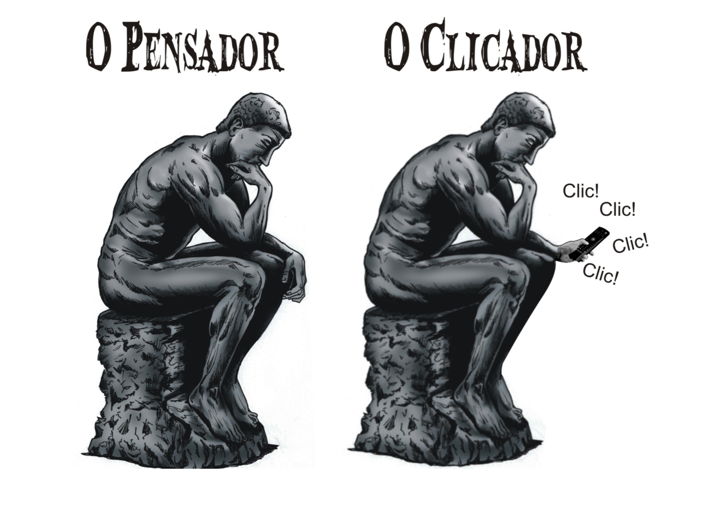

# Tema 2° - COMUNICAÇÃO E CARREIRA PROFISSIONAL: PERSPECTIVAS PARA UM NOVO CONTEXTO

Nesta unidade temática, você aprenderá sobre a importância da comunicação e suas perspectivas no contexto profissional. Alguns dos tópicos abordados incluem:

1. Interpretar o atual contexto e entender a relação entre a capacidade comunicativa e o sucesso profissional.
2. Compreender a complexidade social, a pluralidade e os diferentes espaços de comunicação.
3. Comunicar-se ciente de que a comunicação não é uma via de mão única.
4. Comunicar-se ciente da relação entre linguagem e corpo.
5. Comunicar-se ciente da relação entre domínio do conteúdo e segurança na comunicação.

O texto menciona que a boa capacidade de comunicação é essencial para o sucesso profissional nos dias atuais. Rosa e Landim afirmam que a comunicação começa antes mesmo de desempenhar uma função específica, pois é importante desde o momento de conseguir um emprego ou um contrato de serviço. Não possuir habilidades de comunicação coloca o indivíduo em desvantagem em relação aos concorrentes.

O contexto atual, com suas mudanças sociais e econômicas, demanda diversas competências para os profissionais, como proatividade, habilidade de relacionamento e criatividade na resolução de problemas. A comunicação é considerada o pilar mestre dessas competências. Viver em uma sociedade plural, compreender e respeitar a diversidade são essenciais. Além disso, a velocidade da comunicação no século XXI é outro fator a ser considerado, com o avanço acelerado das tecnologias de comunicação e transporte.

O texto também destaca que a capacidade comunicativa de um indivíduo não está diretamente ligada apenas ao conhecimento gramatical, mas sim à forma como ele utiliza a linguagem. Existem comunicadores excelentes com baixo nível de escolaridade e eruditos com dificuldades de se comunicar de forma adequada em diferentes situações. Dominar o conhecimento gramatical é importante, mas apenas um aspecto da competência comunicativa.

A boa capacidade de comunicação envolve o uso adequado da linguagem em diferentes situações, desenvolvido por meio da prática da leitura, escrita, comunicação oral e da consideração das demandas sociais da linguagem. É essencial adequar o nível de linguagem de acordo com o interlocutor, transitando do nível coloquial ao culto conforme necessário.

Portanto, a comunicação eficaz é crucial para o sucesso profissional, pois permite transmitir ideias de forma clara e convincente, promover-se e estabelecer boas relações interpessoais. No atual contexto, em que vivemos na sociedade da informação, com diversidade e velocidade de comunicação, a habilidade de se comunicar com todos e compreender a pluralidade é fundamental.

## O atual mercado de trabalho e suas exigências comunicacionais

“O papel da comunicação começa bem antes de sua atuação em uma determinada função, começa na hora de conseguir um emprego ou um contrato para prestar um serviço [...]. Sem essa habilidade ele [o sujeito] já sai em desvantagem em relação aos seus concorrentes” (2009, p. 142)."

Não basta ser um “gênio” em sua área de atuação se ninguém entende o que você fala. Suas ideias brilhantes pouco lhe valerão alguma coisa se, na hora de apresentá-las ao público, não souber ordená-las de forma convincente, e argumentar de maneira clara e objetiva. Seu sucesso é do tamanho de suas habilidades de comunicação. Se você não ocupa o lugar que acredita merecer, é porque ainda não aprendeu a comunicar ao mundo suas habilidades. (LIMA, 2015, p. 1)

## Comunicação e pluralismo na sociedade contemporânea

Diferentemente da sociedade moderna anterior, a que eu chamo de modernidade sólida, que também estava sempre a desmontar a realidade herdada, a de agora não o faz com uma perspectiva de uma longa duração, com a intenção de torná-la melhor e novamente sólida. Tudo é temporário. É por isso que sugeri a metáfora da “liquidez” para caracterizar o estado da sociedade moderna, que, como os líquidos, se caracterizam por uma incapacidade de manter a forma. Nossas instituições, quadros de referência, estilos de vida, crenças e convicções mudam antes que tenham tempo de se solidificar em costumes, hábitos e verdades “autoevidentes”.

BAUMAN, Zygmunt. A sociedade líquida. Folha de São Paulo, São Paulo, 19 out. 2003. Mais!, p 5-6.

## Oralidade, trabalho e relações interpessoais

Diferenças individuais são as várias formas em que os indivíduos se distinguem uns dos outros, sejam nos aspectos físicos, psíquicos, intelectuais, emocionais ou sociais. O conceito de relacionamento pessoal se estende por uma variedade de comportamentos e atitudes que determinam o seu grau de convívio em sociedade. Quanto maior a sua capacidade de expor e respeitar as opiniões de terceiros maior serão as suas habilidades de relacionamento interpessoal, isso é muito importante na sociedade atual tanto na esfera profissional como na pessoal. Muitas pessoas assumem determinadas posturas nos relacionamentos em geral como instrumento de posicionamento, ou seja, a pessoa pode assumir posturas comportamentais passivas ou agressivas, tudo isso relacionado ao seu suposto papel naquele contexto social. Os principais conceitos de relacionamento pessoal são: relacionamento interpessoal profissional, pessoal, e mais recentemente o virtual, que consiste no comportamento que o indivíduo assume no mundo virtual. (GHELMAN, 2016, p. 05)

## Saber falar, mas também saber ouvir: o diálogo como base da boa relação pessoal e profissional

Em um diálogo, no entanto, ninguém está tentando ganhar. Todo mundo ganha se alguém ganhar. Há uma espécie de jogo diferente quando se dialoga. Trata-se de um jogo onde não há tentativas de ganhar pontos ou de fazer prevalecer um lado. Ao invés disso, sempre que um erro é descoberto por parte de alguém, todo mundo sente ter ganho. É um jogo chamado ganha-ganha, enquanto que o outro jogo é chamado ganha–perde. No diálogo não estamos jogando uns contra os outros, mas todos com todos. (BOHM, 2017, p. 09)

## Imagens

## Referências

- [https://sites.google.com/ulbra.br/G000002GS002/t002](https://sites.google.com/ulbra.br/G000002GS002/t002)
