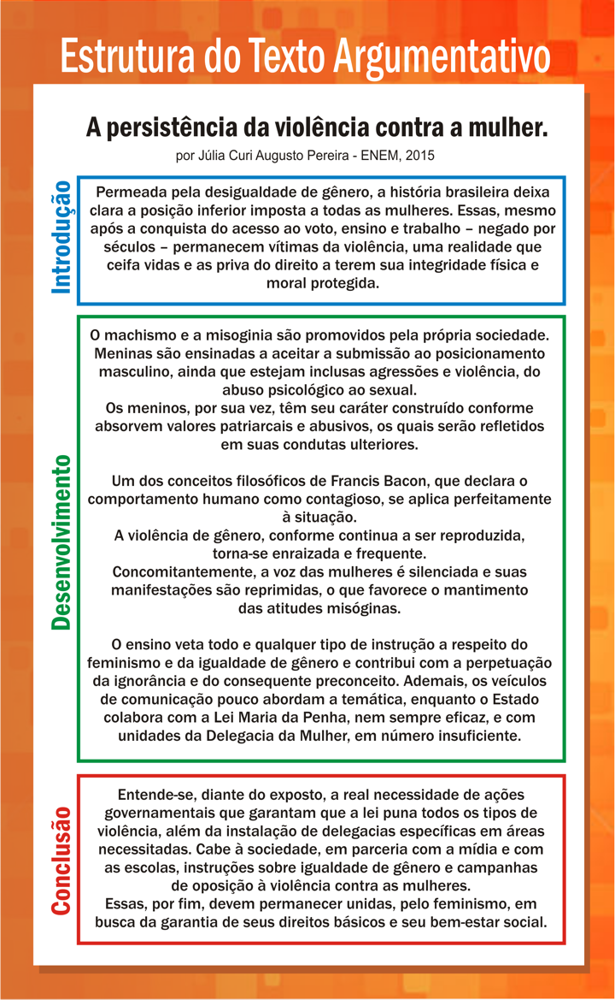

# Tema 3° - ARGUMENTAÇÃO E PRODUÇÃO ESCRITA

Argumentação e produção escrita são habilidades essenciais para se expressar de forma clara, coerente e persuasiva. Nessa unidade temática, você aprenderá a se comunicar oralmente e por escrito, adaptando-se a diferentes situações, entenderá a importância da boa comunicação para o sucesso profissional e desenvolverá a capacidade de formular argumentos consistentes.

A unidade começa introduzindo a distinção entre linguagem verbal e não verbal, destacando a importância da linguagem escrita e visual na comunicação. Também ressalta a importância da leitura e do conhecimento como base para uma escrita eficaz.

Em seguida, aborda o conceito de argumentação como uma forma de persuadir ou convencer alguém a adotar determinado ponto de vista. Os textos argumentativos, como dissertações e argumentações, são explorados, destacando a diferença entre expor ideias e persuadir o leitor.

A estrutura do texto argumentativo é explicada, com ênfase na introdução, desenvolvimento e conclusão. A introdução apresenta a tese, a ideia principal a ser desenvolvida, e pode ser feita de diversas maneiras, como por meio de declarações afirmativas ou negativas, perguntas, definições, alusões históricas ou citações. O desenvolvimento consiste na defesa da tese por meio de argumentos, que podem incluir fatos, exemplos, ilustrações, dados estatísticos, entre outros. A conclusão fecha o texto reafirmando o assunto, retomando a introdução, sintetizando os argumentos ou fazendo uma proposta de solução.

Além da estrutura, são apresentados os aspectos básicos da argumentação e produção escrita. A coerência e a coesão são fundamentais para garantir a compreensão do texto, enquanto o domínio da língua culta, incluindo a impessoalidade, é essencial para uma boa argumentação. Exemplos de textos argumentativos são analisados para ilustrar esses aspectos.

No geral, a unidade tem como objetivo desenvolver suas habilidades de comunicação escrita, argumentação e tomada de decisões, visando sua autonomia e sucesso profissional.

## Introdução: apresentação da tese

### Declaração afirmativa (ou negativa) :

Serve para fazer uma declaração forte, capaz de surpreender o leitor; é a forma mais comum em um texto argumentativo.

_Ex.: “É um grave erro a liberação da maconha.”_

### Interrogação:

Serve para despertar a atenção do leitor para o tema e será respondida ao longo da argumentação.

_Ex.: “Será que é com novos impostos que a saúde melhorará no Brasil?”_

### Definição:

É uma forma didática, simples e muito usada, porque esclarece o significado para o leitor do conceito introduzido pelo argumentador.

_Ex.: “Justiça é a particularidade do que é justo e correto, como o respeito à igualdade de todos os cidadãos._

### Alusão histórica:

O conhecimento dos principais fatos históricos sinaliza que o argumentador tem conhecimento sobre o assunto, além de o leitor ser situado no tempo e ter uma melhor dimensão do problema.

_Ex.: “Após a queda do Muro de Berlim, acabaram-se os antagonismos Leste-Oeste, e o mundo parece ter aberto as portas para a globalização.”_

### Citação:

É usar as palavras de outra pessoa, sua função é apoiar, sustentar as ideias do argumentador. A citação direta aparece exatamente como foi dita, por isso deve ter aspas e indicar seu autor. Enquanto, na indireta, usamos nossas palavras para explicar o que foi dito, ou seja, uma espécie de paráfrase. Quando usarmos a citação indireta, não é necessário o uso de aspas, mas é preciso indicar o nome do autor.

_Ex.: “Para Marx, a religião é o ópio do povo.”_

### Comparação:

Serve para comparar lugares, objetos, seres, mostrando semelhanças e/ou diferenças.

_Ex.: “Enquanto países, como a Inglaterra e Canadá, têm leis que protegem as crianças da exposição ao sexo e à violência na televisão, no Brasil não há nenhum controle efetivo sobre a programação na televisão.”_

## Desenvolvimento: defesa da tese

### Argumento pragmático ou evidência:

O argumentador inclui dados (como fatos, números, estatísticas) coletados pelo próprio redator ou por uma fonte respeitável. Esse recurso é explorado quando o objetivo é contestar um ponto de vista equivocado.

_Ex.: “A proibição do aborto coloca a vida da mulher em risco: todo ano, 250 mil brasileiras são internadas por complicações de aborto ilegal.”_

### Argumento de consenso:

Fundamenta-se em verdades supostamente universais, indiscutíveis.

_Ex.: “Os investimentos em pesquisa são indispensáveis para que um país supere sua condição de dependência.”_

### Argumento por comparação (analogia):

O argumentador compara a questão que está sendo discutida com outra similar.

_Ex.: “Nova York, Tóquio e São Paulo, grandes centros urbanos, têm aumentado a sua densidade demográfica, apresentando pontos positivos e negativos aos seus habitantes.”_

### Argumento por exemplificação:

Consiste em informações dadas a partir de exemplos, que podem se originar de citações de autoridades ou de dados concretos, isto é, quando o argumentador cita exemplo(s) do que ele afirma.

_Ex.: “Os jogadores brasileiros de futebol, assim que começam a se destacar aqui no nosso país, logo são vendidos para times internacionais. É o que aconteceu com Ronaldo Fenômeno, que passou a maior parte de sua carreira no exterior.”_

### Argumento de autoridade citada:

É a marca registrada do discurso acadêmico. Seu objetivo é legitimar uma tese com base na citação de argumentos proferidos por pessoas consideradas autoridades no assunto em questão.

_Ex.: “O tratamento da Aids, no Brasil, é referência para todos os outros países, conforme afirmou o Dr. Drauzio Varella.”_

## Conclusão: fecho do texto

É a parte final da argumentação que procede naturalmente das provas arroladas, dos argumentos apresentados; consiste em pôr em termos insofismáveis a essência da proposição. Na formulação da conclusão, podemos:

- Reafirmar o assunto;
- Fazer referência ao título;
- Retomar a introdução em outras palavras;
- Sintetizar os argumentos;
- Confirmar a tese com uma paráfrase;
- Fazer uma advertência;
- Fazer uma sugestão;
- Fazer uma possível proposta de solução para o problema apresentado na introdução e discutido no desenvolvimento.

A transição entre o desenvolvimento e a conclusão é feita, geralmente, por meio de conectores conclusivos que indicam a relação que desejamos estabelecer, tais como: Portanto, ...; Dessa forma, ...; Isso posto, ...; Em face do exposto, ...; Por conseguinte, ...; Em vista disso, ...; Por tais razões, ...; Por tudo isso, ...

## Imagens

## Referências

- [https://sites.google.com/ulbra.br/G000002GS002/t003](https://sites.google.com/ulbra.br/G000002GS002/t003)
- [https://drive.google.com/file/d/1INCIOEA3irOoTvFN9gmYYiXWIYjmZcBY/view](https://drive.google.com/file/d/1INCIOEA3irOoTvFN9gmYYiXWIYjmZcBY/view)
