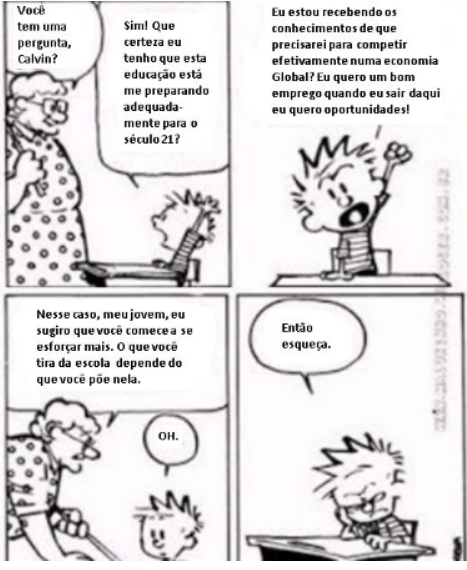
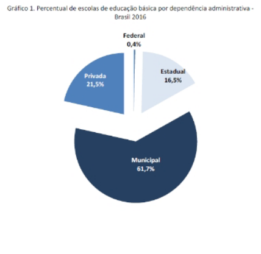
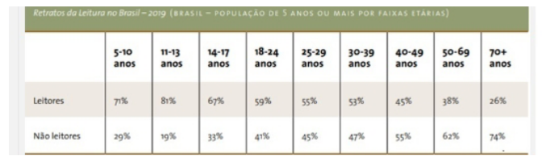

## Questão 1°

##### Considere a situação a seguir:

#### Um grupo de crianças concentradas mexendo no celular, enquanto no centro da sala onde elas estão, deixados sem atenção, estão vários brinquedos, tais como peteca, bola, figurinhas, pipa.

##### Essa descrição tem por objetivo principal:

- [ ] Influenciar o leitor a mudar atitudes e hábitos prejudiciais ao público em geral.
- [ ] Divulgar informações científicas sobre o uso indiscriminado de aparelhos celulares.
- [x] Sugerir outras possibilidades de lazer ao invés do celular para o público infantil.
- [ ] Especificar exclusivamente aos professores a substituição de dispositivos móveis por outras atividades.
- [ ] Relacionar o uso da tecnologia aos efeitos decorrentes da falta de exercícios físicos.

## Questão 2°

##### Considere o pensamento de Confúcio abaixo.

_"Escolha um trabalho de que goste, e não terá que trabalhar nem um dia da sua vida"._

#### Considerando o exercício de sua capacidade de ler e compreender o objeto da leitura, este pensamento de Confúcio só será plenamente compreendido pelo leitor se:

- [x] Elaborar um raciocínio baseado na construção de inferências.
- [ ] Utilizar seu conhecimento linguístico quanto ao significado das palavras aplicadas nesta afirmação.
- [ ] perceber a diferença entre "trabalho" e "trabalhar" no que concerne ao seu conhecimento de mundo.
- [ ] Relacionar a afirmação de Confúcio à sua rotina de trabalho, utilizando seu conhecimento interacional.
- [ ] Lançar mão do conhecimento enciclopédico no intuito de saber quem foi Confúcio.

## Questão 3°

##### Analise se as seguintes assertivas são verdadeiras ou falsas.

#### I . É possível adaptarmos nossa linguagem conforme a necessidade.

#### II . A linguagem informal é utilizada num ambiente mais familiar. Num lugar /contexto menos formal.

#### III . Variação diastrática trata da organização socioeconômica e cultural de uma comunidade.

- [ ] Apenas a I é verdadeira.
- [ ] Apenas a III é verdadeira.
- [x] I, II e III são verdadeiras.
- [ ] Apenas a II é verdadeira.
- [ ] Apenas II e III são verdadeiras.

## Questão 4°

##### Leia as afirmativas abaixo.

#### A compreensão do significado de uma palavra depende do domínio de um código ou convenção. Por exemplo, para entender o que é uma casa em países onde não se fala português, é preciso aprender o código linguístico (o idioma) que cada uma dessas sociedades utiliza para expressar o significado daquilo que denominamos "casa".

### Porque

#### Não há nenhuma semelhança entre as palavras casa, Haus (Alemão), house (Inglês), Maison (Francês), indlu (Zulu) e o objeto que reconhecemos como uma casa.

##### Sobre essas duas afirmativas, assinale a alternativa correta.

- [ ] As duas são verdadeiras, mas não estabelecem relação entre si.
- [x] As duas são verdadeiras, e a segunda é uma justificativa correta da primeira.
- [ ] As duas são falsas.
- [ ] A primeira é uma afirmativa verdadeira; e a segunda, falsa.
- [ ] A primeira é uma afirmativa falsa; e a segunda, verdadeira.

## Questão 5°

##### Sobre a charge abaixo, é correto afirmar o seguinte:

#### I - No primeiro quadrinho, Calvin coloca em dúvida o tipo de educação que está recebendo na escola.

#### II - A professora, no terceiro quadrinho, apoia a opinião de Clavin

#### III - É possível concluir que a charge faz uma crítica irônica à concepção segundo a qual é possível ter sucesso sem esforço

- [ ] Apenas a III está correta.
- [ ] Apenas a I está correta.
- [ ] Apenas I e II estão corretas.
- [x] Apenas I e III estão corretas
- [ ] Apenas a II está correta.

## Questão 6°

##### Analise as informações a seguir e assinale a alternativa correta.

#### I - O ser humano, como um ser social, desenvolveu a linguagem pela necessidade de se comunicar, sendo a língua um de seus meios mais utilizados.

#### II - Todas as línguas vivas mudam com o tempo. É um processo dinâmico, contínuo e gradativo.

#### III - Nem todas as línguas possuem variação.

- [ ] Apenas a assertiva III é verdadeira.
- [x] Apenas as assertivas I e II são verdadeiras.
- [ ] Apenas a assertiva II é verdadeira.
- [ ] Apenas as assertivas I e III são verdadeiras.
- [ ] Apenas a assertiva I é verdadeira.

## Questão 7°

##### No que se refere à argumentação, avalie as afirmativas seguintes.

#### I. O texto argumentativo é um tipo de texto que possui objetivo particular no processo de comunicação. Sua finalidade precípua é manifestar opinião e debater ideias, a fim de defender uma tese por meio de argumentos.

#### II. É um tipo de texto que predomina em variados gêneros textuais, como: artigos de opinião e editoriais de revistas e jornais, petições de advogados, discursos em debates políticos, resenhas, cartas do leitor, entre outros.

#### III. Texto argumentativo é o tipo textual marcado por uma linguagem simples, objetiva, clara, impessoal, sendo que um dos recursos linguísticos marcantes desse tipo de texto é a utilização dos verbos no imperativo, típicos de uma atitude coercitiva.

##### É correto o que se afirma em:

- [x] I e II, apenas.
- [ ] I, II e III.
- [ ] I e III apenas.
- [ ] II, apenas.
- [ ] III, apenas.

## Questão 8°

##### Leia as afirmativas abaixo.

#### O ser humano produziu inúmeras mídias para armazenar e distribuir informações e, dessa forma, ampliar a sua capacidade de comunicação.

#### Porque

#### A nossa voz, por mais eficiente que possa ser em situações de fala, não tem uma duração efêmera.

##### Sobre essas duas afirmativas, assinale a alternativa correta.

- [ ] A primeira é uma afirmativa falsa; e a segunda, verdadeira.
- [x] A primeira é uma afirmativa verdadeira; e a segunda, falsa.
- [ ] As duas são falsas.
- [ ] As duas são verdadeiras, e a segunda é uma justificativa correta da primeira.
- [ ] As duas são verdadeiras, mas não estabelecem relação entre si.

## Questão 9°

##### Marque V para as afirmações verdadeiras e F para as afirmações falsas.

#### ( ) A história da humanidade nos mostra que o ser humano se relaciona com o mundo e organiza o mundo, para si, por meio da linguagem.

#### ( ) Dentre as várias formas de linguagem, a palavra, verbalizada ou escrita, é a matéria-prima da formação de nosso saber cultural, político, científico, filosófico, religioso e tecnológico.

#### ( ) A natureza comunicacional do ser humano é uma complexa rede de relações e de variáveis.

- [ ] F - V - V.
- [ ] V - F - V.
- [ ] F - V - F.
- [ ] V - V - F.
- [x] V - V - V.

## Questão 10°

### Adolescentes: mais altos, gordos e preguiçosos

#### A oferta de produtos industrializados e a falta de tempo têm sua parcela de responsabilidade no aumento da silhueta dos jovens. "Os nossos hábitos alimentares, de modo geral, mudaram muito", observa Vivian Ellinger, presidente da Sociedade Brasileira de Endocrinologia e Metabologia (SBEM), no Rio de Janeiro. Pesquisas mostram que, aqui no Brasil, estamos exagerando no sal e no açúcar, além de tomar pouco leite e comer menos frutas e feijão. Outro pecado, velho conhecido de quem exibe excesso de gordura por causa da gula, surge como marca da nova geração: a preguiça. "Cem por cento das meninas que participam do Programa não praticavam nenhum esporte", revela a psicóloga Cristina Freire, que monitora o desenvolvimento emocional das voluntárias. Você provavelmente já sabe quais são as consequências de uma rotina sedentária e cheia de gordura. "E não é novidade que os obesos têm uma sobrevida menor", acredita Claudia Cozer, endocrinologista da Associação Brasileira para o Estudo da Obesidade e da Síndrome Metabólica. Mas, se há cinco anos os estudos projetavam um futuro sombrio para os jovens, no cenário atual as doenças que viriam na velhice já são parte da rotina deles. "Os adolescentes já estão sofrendo com hipertensão e diabete", exemplifica Claudia. DESGUALDO, P. Revista Saúde. Disponível em: http://saude.abril.com.br. Acesso em: 28 jul. 2012 (adaptado).

##### Sobre a relação entre os hábitos da população adolescente e as suas condições de saúde, as informações apresentadas no texto indicam que

- [ ] A prática regular de atividade física é um importante fator de controle da diabetes entre a população adolescente, por provocar um constante aumento da pressão arterial sistólica.
- [x] A falta de atividade física somada a uma alimentação nutricionalmente desequilibrada constituem fatores relacionados ao aparecimento de doenças crônicas entre os adolescentes.
- [ ] A maior participação dos alimentos industrializados e gordurosos na dieta da população adolescente tem tornado escasso o consumo de sais e açúcares, o que prejudica o equilíbrio metabólico.
- [ ] A diminuição do consumo de alimentos fontes de carboidratos combinada com um maior consumo de alimentos ricos em proteínas contribuíram para o aumento da obesidade entre os adolescentes
- [ ] A ocorrência de casos de hipertensão e diabetes entre os adolescentes advém das condições de alimentação,enquanto que na população adulta os fatores hereditários são preponderantes

## Questão 11°

#### Assinale a alternativa incorreta em relação aos nossos estudos sobre Comunicação.

- [ ] É comum encontrarmos pessoas, tanto em momentos formais como em simples bate-papos, que não permitem que seus interlocutores concluam seus pensamentos, intervindo em momentos inoportunos e interrompendo a fala dos outros constantemente.
- [ ] O silêncio faz parte da competência comunicacional de um indivíduo, e ele deve, da mesma forma, ser exercitado. Nunca devemos interromper o pensamento daquele que está falando.
- [ ] Até mesmo a concordância com aquele que discursa, na tentativa equivocada de colaborar, acaba interrompendo o fluxo de pensamento do outro.
- [x] O diálogo assemelha-se a uma discussão, pois o objetivo é transmitir um ponto de vista e persuadir os outros a adotá~lo como verdade.
- [ ] Devemos dar ao nosso interlocutor o tempo necessário para que conclua seu raciocínio e para que discorra, também, sobre suas ideias.

## Questão 12°

##### Assinale a alternativa que apresenta uma interpretação reconstrutiva correta do trecho abaixo.

#### O Tinder, aplicativo de paquera baseado em geolocalização, virou febre entre a geração Y americana e brasileira e é a maior promessa de aumento de receita do Match Group.

- [x] O aplicativo de paquera Tinder, baseado em proximidade geográfica, tornou-se uma mania entre a geração Y americana e brasileira, prometendo o incremento da receita do Match Group.
- [ ] O aplicativo de paquera Tinderé o vilão dos relacionamentos amorosos atuais entre jovens da geração Y americana e brasileira.
- [ ] O Tinder, site de paquera baseado em proximidade geográfica, tornou-se um subterfúgio entre a geração Y americana e brasileira, aumentando a receita do Match Group.
- [ ] O app de paquera, baseado em proximidade geográfica, o Tinder, tornou-se uma mania entre a geração americana e brasileira, ampliando a receita do Match Group.
- [ ] Um app de paquera, o Tinder, tornou-se uma mania entre a geração americana e brasileira, garantindo a receita do Match Group

## Questão 13°

##### Leia com atenção o texto retirado do site do Tribunal de Justiça do Estado do Paraná (https://www.tjpr.jus.br/noticias-2-vice/-/asset_publisher/sTrhoYRKnlQe/content/o-perigo-das-fake-news/14797?inheritRedirect=false) e, em seguida, assinale a alternativa correta.

### Consequências das fake news

#### O compartilhamento de informações fraudulentas tem grandes consequências, apesar de parecer inofensivo. No Brasil, em 2014, a disseminação de uma fake news provou uma verdadeira tragédia. Na ocasião, uma mulher foi linchada até a morte por moradores da cidade de Guarujá, em São Paulo. Fabiane Maria de Jesus tinha 33 anos, era dona de casa, casada, mãe de duas crianças, e foi confundida com uma suposta sequestradora de crianças, cujo retrato falado, que havia sido feito dois anos antes, estava circulando nas redes sociais.

#### Outro caso famoso de disseminação de fake news é o do movimento antivacinação. Indivíduos contrários ao uso de vacinas espalharam conteúdos falsos, alegando que as composições químicas das vacinas eram prejudiciais à população. As informações afirmavam que os medicamentos contra febre amarela, poliomielite, sarampo, microcefalia e gripe poderiam ser um risco para a saúde, provocando as respectivas doenças nas pessoas, quando vacinadas.

#### Uma das consequências da propagação dessas falsas informações foi o crescimento alarmante no número de casos de sarampo no Brasil, em 2018, o que acarretou numa campanha intensa realizada pelo Ministério da Saúde. A fim de combater as fake News referentes ao assunto, o órgão lançou propagandas e informativos de combate às falsas informações sobre vacinas em diferentes veículos de comunicação e nas redes sociais.

#### Outro resultado da disseminação de tais notícias foi uma população desconfiada do sistema público de saúde e muitos outros órgãos que atendiam às campanhas de vacinação, além de uma considerável diminuição no número de pessoas imunizadas, algo extremamente perigoso em épocas de epidemias e surtos.

- [ ] No Brasil, em 2014, um retrato falado que circulou nas redes sociais ajudou a polícia a prender uma sequestradora.
- [ ] De acordo com o texto, as redes sociais da internet sempre trazem conteúdos confiáveis e, inclusive, nos últimos anos, têm auxiliado a população no combate à pobreza e na erradicação de doenças.
- [x] O compartilhamento de conteúdo falso através das redes sociais da internet tem a capacidade de produzir consequências nefastas na vida de alguns indivíduos, além de prejudicar o funcionamento de instituições públicas.
- [ ] De acordo com o texto, compartilhar informações falsas faz parte da cultura da internet e se caracteriza como um modo saudável de entretenimento proporcionado pelas mídias digitais.
- [ ] Uma das consequências da propagação de informações sobre saúde, nas redes sociais, foi o crescimento no número de pessoas que se vacinaram contra o sarampo no Brasil, em 2018.

## Questão 14°

#### A linguagem corporal foi uma das primeiras formas de co- municação humana e continua sendo uma das mais fortes e expressivas. Além da comunicação, por meio de gestos, você pode fazer alguém entender o que você quer. Mas, muitas vezes, o corpo mostra sinais que indicam o que você está pensando ou sentindo sem que você perceba. É que o sistema límbico, responsável pelos sentimentos, envia impulsos elétricos ao corpo, gerando expressões e movimentos sem nos darmos conta. Disponível em: <http://revistavivasaude.uol.com.br/ saude-nutricao/113/artigo265382-1.asp>.

##### Leia as seguintes afirmações sobre o emprego de recursos linguísticos no texto.

#### I - O período "por meio de gestos, você pode fazer alguém entender o que você quer" poderia ser assim reescrito, sem prejuízo ao texto: por meio de gestos, você pode fazer com que entendam os seus desejos.

#### II - A expressão "mas" (linha 04) contrapõe os gestos intencionais que o corpo comunica aos sinais impulsivos, provocados pelo sistema límbico.

#### III - No trecho "Mas, muitas vezes, o corpo mostra sinais que indicam o que você está pensando ou sentindo sem que você perceba", a palavra "que" foi aplicada três vezes. Uma forma de reduzir o emprego desse conector seria: Mas, muitas vezes, o corpo mostra sinais indicativos do que você está pensando ou sentindo sem você perceber.

##### Sobre as proposições acima, escolha a alternativa correta.

- [ ] Apenas III está correta.
- [ ] Apenas II está correta.
- [ ] Apenas I e III estão corretas.
- [ ] Apenas I está correta.
- [x] I, II e III estão corretas.

## Questão 15°

##### No que se refere à argumentação, avalie as afirmativas seguintes.

#### I. O texto argumentativo é um tipo de texto que possui objetivo particular no processo de comunicação. Sua finalidade precípua é manifestar opinião e debater ideias, a fim de defender uma tese por meio de argumentos.

#### II. É um tipo de texto que predomina em variados gêneros textuais, como: artigos de opinião e editoriais de revistas e jornais, petições de advogados, discursos em debates políticos, resenhas, cartas do leitor, entre outros.

#### III. Texto argumentativo é o tipo textual marcado por uma linguagem simples, objetiva, clara, impessoal, sendo que um dos recursos linguísticos marcantes desse tipo de texto é a utilização dos verbos no imperativo, típicos de uma atitude coercitiva.

##### É correto o que se afirma em:

- [ ] II, apenas.
- [x] I e II, apenas.
- [ ] I e III apenas.
- [ ] I, II e III.
- [ ] III, apenas.

## Questão 16°

#### Marque V para as afirmações verdadeiras e F para as afirmações falsas a partir da análise do meme abaixo.

#### ( ) O meme apresenta uma crítica ao desperdício de tempo assistindo a filmes, já que faz referência ao personagem de um filme.

#### ( ) O meme apresenta uma crítica ao desperdício de tempo utilizado no whatsapp.

#### ( ) O meme apresenta ironia tanto na linguagem verbal quanto na imagem.

- [ ] V - V - F.
- [ ] F - V - F.
- [ ] V - F - V.
- [ ] V - V - V.
- [x] F - V - V.

## Questão 17°

##### Analise as informações a seguir e assinale a alternativa correta.

#### I - A comunicação não é uma via de mão única. Não podemos esquecer de que não só precisamos aprender a falar, a nos comunicarmos bem, mas também a ouvir.

#### II - Saber ouvir não é apenas uma ação de escutar, mas buscar compreender o que está sendo dito, respeitar, bem como observar os mesmos sinais da linguagem não verbal utilizados por você quando está falando.

#### III - Uma boa comunicação independe de uma boa sensibilidade. A habilidade de ler o contexto não interfere nos sentidos da comunicação.

- [x] Apenas as assertivas I e II são verdadeiras.
- [ ] Apenas a assertiva III é verdadeira.
- [ ] Apenas as assertivas I e III são verdadeiras.
- [ ] Apenas a assertiva I é verdadeira.
- [ ] Apenas a assertiva II é verdadeira.

## Questão 18°

##### Marque V para as afirmações verdadeiras e F para as afirmações falsas.

#### ( ) Na linguagem mista, usam-se simultaneamente a linguagem verbal e a linguagem não verbal. É o uso de palavras escritas e figuras simultaneamente.

#### ( ) A linguagem mista é pouco comum em nossos dias; pode aparecer em placas, histórias em quadrinhos, charges, outdoors, filmes, peças de publicidade etc.

#### ( ) A linguagem mista, em alguns casos, reforça o que a linguagem não verbal já apresenta por si só, mas independe do objetivo e do público que essa mensagem quer atingir

- [ ] V - V - F.
- [ ] F - V - F.
- [ ] F - V - V.
- [x] V - F - F.
- [ ] V - V - V.

## Questão 19°

##### Leia o texto a seguir.

#### Acordava ainda no escuro, como se ouvisse o sol chegando das beiradas da noite. E logo sentava-se ao tear.

#### Linha clara, para começar o dia. Delicado traço cor da luz, que ela ia passando entre os fios estendidos, enquanto lá fora a claridade da manhã desenhava o horizonte.

#### Depois lãs mais vivas, quentes lãs iam tecendo hora a hora, em longo tapete que nunca acabava.

#### Se era forte demais o sol, e no jardim pendiam as pétalas, a moça colocava na lançadeira grossos fios cinzentos do algodão mais felpudo. Em breve, na penumbra trazida pelas nuvens, escolhia um fio de prata, que em pontos longos rebordava sobre o tecido. Leve, a chuva vinha à janela. [...]

#### Tecer era tudo o que fazia. Tecer era tudo o que queria fazer.

#### Mas tecendo e tecendo, ela própria trouxe o tempo em que se sentiu sozinha, e pela primeira vez pensou em como seria bom ter um marido ao lado.

#### Não esperou o dia seguinte. Com capricho de quem tenta uma coisa nunca conhecida, começou a entremear no tapete as lãs e as cores que lhe dariam companhia. E, aos poucos, seu desejo foi aparecendo, chapéu emplumado, rosto barbado, corpo aprumado, sapato engraxado. Estava justamente acabando de entremear o último fio do ponto dos sapatos, quando bateram à porta.

#### Nem precisou abrir. O moço meteu a mão na maçaneta e foi entrando em sua vida.

#### Aquela noite, deitada no ombro dele, a moça pensou nos lindos filhos que teceria para aumentar ainda mais a sua felicidade.

#### E feliz foi, durante algum tempo. Mas se o homem tinha pensado em filhos, logo os esqueceu. Porque tinha descoberto o poder do tear, em nada mais pensou a não ser nas coisas todas que ele poderia lhe dar.

- Uma casa melhor é necessária - disse para a mulher. E parecia justo, agora que eram dois. Exigiu que escolhesse as mais belas lãs cor de tijolo, fios verdes para os batentes, e pressa para a casa acontecer.

#### Mas pronta a casa, já não lhe pareceu suficiente.[...]

#### Afinal o palácio ficou pronto. E entre tantos cômodos, o marido escolheu para ela e seu tear o mais alto quarto da mais alta torre.

- É para que ninguém saiba do tapete - ele disse. E antes de trancar a porta à chave, advertiu: - Faltam as estrebarias. E não se esqueça dos cavalos!

#### Sem descanso tecia a mulher os caprichos do marido, enchendo o palácio de luxos, os cofres de moedas, as salas de criados. Tecer era tudo o que fazia. Tecer era tudo o que queria fazer.

#### E tecendo, ela própria trouxe o tempo em que sua tristeza lhe pareceu maior que o palácio com todos os seus tesouros. E, pela primeira vez, pensou em como seria bom estar sozinha de novo.

#### Só esperou anoitecer. Levantou-se enquanto o marido dormia sonhando com novas exigências. E descalça, para não fazer barulho, subiu a longa escada da torre, sentou-se ao tear.

#### Desta vez não precisou escolher linha nenhuma. Segurou a lançadeira ao contrário, e jogando-a veloz de um lado para o outro, começou a desfazer seu tecido. Desteceu os cavalos, as carruagens, as estrebarias, os jardins. Depois desteceu os criados e o palácio e todas as maravilhas que continha. E novamente se viu na sua casa pequena e sorriu para o jardim da janela.

#### A noite acabava quando o marido estranhando a cama dura, acordou, e, espantado, olhou em volta. Não teve tempo de se levantar. Ela já desfazia o desenho escuro dos sapatos, e ele viu seus pés desaparecendo, sumindo as pernas. Rápido, o nada subiu-lhe pelo corpo, tomou o peito aprumado.

#### Então, como se ouvisse a chegada do sol, a moça escolheu uma linha clara. E foi passando-a devagar entre os fios, delicado traço de luz, que a manhã repetiu na linha do horizonte.

#### A moça tecelã, de Marina Colassanti disponível no site http://grupocontoaconto.blogspot.com

##### Sobre o texto de Marina Colassanti, marque a alternativa correta

- [ ] Do moço que bateu em sua porta, ela teceu somente o chapéu emplumado.
- [ ] Com o moço do chapéu emplumado, a moça foi feliz para sempre.
- [x] Em determinado momento, a moça começou a pensar em como seria bom estar novamente sozinha.
- [ ] A moça teceu o tempo em que percebeu a solidão, então, recebeu a encomenda de um marido.
- [ ] Caprichosamente, começou a tecer aquele que se tornou sua eterna companhia.

## Questão 20°

### NASCE UM ESCRITOR

#### O primeiro dever passado pelo novo professor de português foi uma descrição tendo o mar como tema. A classe inspirou-se, toda ela, nos encapelados mares de Camões, aqueles nunca dantes navegados; o episódio do Adamastor foi reescrito pela meninada.

#### Prisioneiro no internato, eu vivia na saudade das praias do Pontal onde conhecera a liberdade e o sonho. O mar de Ilhéus foi o tema de minha descrição.

#### Padre Cabral levara os deveres para corrigir em sua cela. Na aula seguinte, entre risonho e solene, anunciou a existência de uma vocação autêntica de escritor naquela sala de aula. Pediu que escutassem com atenção o dever que ia ler. Tinha certeza, afirmou, que o autor daquela página seria no futuro um escritor conhecido.

#### Não regateou elogios. Eu acabara de completar onze anos.

#### Passei a ser uma personalidade, segundo os cânones do colégio, ao lado dos futebolistas, dos campeões de matemática e de religião, dos que obtinham medalhas. Fui admitido numa espécie de Círculo Literário onde brilhavam alunos mais velhos. Nem assim deixei de me sentir prisioneiro, sensação permanente durante os dois anos em que estudei no colégio dos jesuítas.

#### Houve, porém, sensível mudança na limitada vida do aluno interno: o padre Cabral tomou-me sob sua proteção e colocou em minhas mãos livros de sua estante. Primeiro "As Viagens de Gulliver", depois clássicos portugueses, traduções de ficcionistas ingleses e franceses. Data dessa época minha paixão por Charles Dickens. Demoraria ainda a conhecer Mark Twain, o norte-americano não figurava entre os prediletos do padre Cabral.

#### Recordo com carinho a figura do jesuíta português erudito e amável. Menos por me haver anunciado escritor, sobretudo por me haver dado o amor aos livros, por me haver revelado o mundo da criação literária. Ajudou-me a suportar aqueles dois anos de internato, a fazer mais leve a minha prisão, minha primeira prisão.

#### Jorge Amado (In: o menino Grapiúna, Rio de Janeiro, Record, 1987, p.117-120)

##### Padre Cabral, numa determinada passagem do texto, ordena que os alunos:

- [ ] Façam uma descrição dos mares nunca dantes navegados
- [x] Façam uma descrição sobre o mar
- [ ] Reescrevam o episódio do Gigante Adamastor
- [ ] Retirem de Camões inspiração para descrever o mar
- [ ] Descrevam os mares encapelados de Camões

## Questão 21°

##### Avalie as afirmativas a seguir, concernentes à assertividade na comunicação.

#### I. Comunicação assertiva escrita consiste na comunicação feita com clareza, objetividade, língua culta, transparência e honestidade.

#### II. No mercado de trabalho atual, a postura assertiva é passiva, agressiva e de manipulação.

#### III. A assertividade é definida como autoexpressão do pensamento por meio da qual a pessoa manifesta o que sente e pensa, defendendo seus direitos sem desrespeitar os direitos básicos dos outros.

#### IV. A assertividade na comunicação é uma qualidade predominante em pessoas com autoconfiança e maturidade.

##### É correto apenas o que se afirma em:

- [ ] III e IV.
- [ ] I e II.
- [ ] II e IV.
- [ ] I e III.
- [x] I, III e IV.

## Questão 22°

##### Leia o seguinte trecho da música "Como uma onda" (cantor Lulu Santos). Em seguida faça o que se pede:

_Tudo o que se vê não é_
_Igual ao que a gente viu há um segundo_
_Tudo muda o tempo todo no mundo..._

##### Assim como referido na música, com base no material do tema 1, as línguas também sofrem mudanças com o tempo. Sobre essas mudanças é correto o que se afirma em:

- [x] As mudanças em uma língua são lentas e graduais.
- [ ] As línguas mudam rapidamente.
- [ ] A língua que muda muito perde muito em qualidade.
- [ ] As mudanças linguísticas são desconexas.
- [ ] A maior parte das línguas nunca mudou.

## Questão 23°

##### Leia o texto abaixo:

#### Uma questão importante na teoria da compreensão de texto é a noção de língua que se adota. A língua é variável, heterogênea e sempre situada em contextos de uso. Justamente por se valorizar a fala é que a língua permite a polissemia. Segundo Ducrot (apud Guimarães, 1989:38): a língua, vista como um conjunto de frases semanticamente descritas, determina, parcialmente pelo menos, as argumentações e valores argumentativos apresentados no discurso. Esta é a tese fundamental da teoria da argumentação da língua.

#### A atividade de compreensão de texto é sempre uma atividade de co-autoria, pois os sentidos são parcialmente produzidos pelo texto/emissor e parcialmente completados pelo leitor.

#### O texto não é algo pronto, fechado e acabado; ele é um processo. Esse processo completa-se com a interação do leitor junto ao texto. Ao leitor cabe o papel de buscar as pistas fornecidas pelo autor no texto, utilizando todo o conhecimento prévio que tem armazenado na memória. Deve ler as entrelinhas (as informações não-visuais) para chegar à compreensão do texto, mas também deve estar atento às marcas linguísticas, aos mecanismos responsáveis pela argumentação como os operadores argumentativos, os marcadores de pressuposição, os modalizadores, a linguagem figurada, a seleção lexical, a repetição, a topicalização etc., assim como aos recursos gráficos: tipo e tamanho de letra, uso de itálico, negrito, travessões, aspas, reticências.

##### A partir do texto acima é possivel inferir:

#### I - A língua é invariável. Um texto escrito na Idade Média, por exemplo, será facilmente intrerpretado.

#### II - O conhecimento que o leitor possui do contexto em que algo foi escrito será importante para compreeensão de determinado texto.

#### III - Num determinado texto é possível destacar palavras, como por exemplo sublinhar, escrever em negrito, etc. quando se quer dar determinada ênfase.

##### Em relação às assertivas está correto o que se afirma em:

- [x] II e III somente.
- [ ] I e II somente.
- [ ] III somente.
- [ ] I e III somente.
- [ ] I, II e III.

##### Leia o texto a seguir:

#### É evidente que o homem, muito mais que a abelha ou outro animal gregário é um animal social. O homem é o único entre os animais que tem o dom da fala. Na verdade, a simples voz pode indicar a dor e o prazer, e outros animais a possuem, mas a fala tem a finalidade de indicar o conveniente e o nocivo e, portanto, também o justo e o injusto (Aristóteles).

##### Em relação ao desenvolvimento, ou seja, a defesa da tese, o texto acima se enquadra como:

- [ ] Argumento pragmático ou evidência.
- [ ] Argumento por comprovação.
- [ ] Argumento de consenso.
- [x] Argumento de autoridade.
- [ ] Argumento por exemplificação.

## Questão 25°

##### Marque V para as afirmações verdadeiras e F para as afirmações falsas a partir da análise do meme abaixo.

#### ( ) O meme faz uma crítica aos reduzidos direitos femininos no antigo regime.

#### ( ) Não é importante um certo conhecimento sobre o tema abordado para compreender o meme.

#### ( ) O meme apresenta ironia tanto na linguagem verbal quanto na imagem.

- [ ] V - V - V.
- [ ] V - F - V.
- [ ] V - V - F.
- [ ] F - V - V.
- [ ] F - V - F.

## Questão 26°

##### De acordo com o gráfico abaixo, que se encontra no último senso escolar realizado pelo Inep, é correto afirmar o seguinte

- [ ] Em comparação com as redes de escolas privadas, as escolas estaduais são majoritárias quanto à oferta de serviços de Educação Básica no Brasil.
- [ ] A educação básica brasileira é responsabilidade principalmente dos estados, cabendo aos municípios e ao setor privado um papel secundário.
- [ ] Há mais escolas da rede privada fornecendo serviços de Educação Básica no Brasil do que escolas das redes municipais.
- [ ] No Brasil, a educação básica é ofertada predominantemente pelo setor privado.
- [x] A maior parte da educação básica do Brasil está sendo realizada sob a responsabilidade dos municípios.

## Questão 27°

##### Qual é o papel do artista para mudar o estado das coisas?

#### O que sempre tiveram. O teatro é o lugar de discussão do homem, tanto que é uma das coisas que mais incomo- dam quem quer manipular as massas. No momento em que você atua sobre a inteligência e a sensibilidade de um povo, que é o que o artista faz, você está indo além dos panfletos. (Fábio Prikladnicki. Entrevista com a atriz Nathalia Tim- berg. Zero Hora, 15 set. 2017)

##### Sobre esse trecho da entrevista com a atriz Nathalia Tin- berg, pode-se inferir o que segue.

#### I - O papel do artista se alterou nas últimas décadas, pos- to que passou a provocar discussão.

#### II - Para mudar o estado das coisas, o artista atua na inte- ligência e na sensibilidade das pessoas.

#### III - O papel do artista é panfletário, pois ele provoca dis- cussão sem mudar o estado das coisas.

##### Sobre as proposições dadas, escolha a alternativa correta.

- [x] Apenas II está correta.
- [ ] Apenas II e III estão corretas.
- [ ] Apenas III está correta.
- [ ] Apenas I e II estão corretas.
- [ ] Apenas I está correta.

## Questão 28°

##### Leia o texto a seguir.

#### Acordava ainda no escuro, como se ouvisse o sol chegando das beiradas da noite. E logo sentava-se ao tear.

#### Linha clara, para começar o dia. Delicado traço cor da luz, que ela ia passando entre os fios estendidos, enquanto lá fora a claridade da manhã desenhava o horizonte.

#### Depois lãs mais vivas, quentes lãs iam tecendo hora a hora, em longo tapete que nunca acabava.

#### Se era forte demais o sol, e no jardim pendiam as pétalas, a moça colocava na lançadeira grossos fios cinzentos do algodão mais felpudo. Em breve, na penumbra trazida pelas nuvens, escolhia um fio de prata, que em pontos longos rebordava sobre o tecido. Leve, a chuva vinha à janela. [...]

#### Tecer era tudo o que fazia. Tecer era tudo o que queria fazer.

#### Mas tecendo e tecendo, ela própria trouxe o tempo em que se sentiu sozinha, e pela primeira vez pensou em como seria bom ter um marido ao lado.

#### Não esperou o dia seguinte. Com capricho de quem tenta uma coisa nunca conhecida, começou a entremear no tapete as lãs e as cores que lhe dariam companhia. E, aos poucos, seu desejo foi aparecendo, chapéu emplumado, rosto barbado, corpo aprumado, sapato engraxado. Estava justamente acabando de entremear o último fio do ponto dos sapatos, quando bateram à porta.

#### Nem precisou abrir. O moço meteu a mão na maçaneta e foi entrando em sua vida.

#### Aquela noite, deitada no ombro dele, a moça pensou nos lindos filhos que teceria para aumentar ainda mais a sua felicidade.

#### E feliz foi, durante algum tempo. Mas se o homem tinha pensado em filhos, logo os esqueceu. Porque tinha descoberto o poder do tear, em nada mais pensou a não ser nas coisas todas que ele poderia lhe dar.

- Uma casa melhor é necessária - disse para a mulher. E parecia justo, agora que eram dois. Exigiu que escolhesse as mais belas lãs cor de tijolo, fios verdes para os batentes, e pressa para a casa acontecer.

#### Mas pronta a casa, já não lhe pareceu suficiente.[...]

#### Afinal o palácio ficou pronto. E entre tantos cômodos, o marido escolheu para ela e seu tear o mais alto quarto da mais alta torre.

- É para que ninguém saiba do tapete - ele disse. E antes de trancar a porta à chave, advertiu: - Faltam as estrebarias. E não se esqueça dos cavalos!

#### Sem descanso tecia a mulher os caprichos do marido, enchendo o palácio de luxos, os cofres de moedas, as salas de criados. Tecer era tudo o que fazia. Tecer era tudo o que queria fazer.

#### E tecendo, ela própria trouxe o tempo em que sua tristeza lhe pareceu maior que o palácio com todos os seus tesouros. E, pela primeira vez, pensou em como seria bom estar sozinha de novo.

#### Só esperou anoitecer. Levantou-se enquanto o marido dormia sonhando com novas exigências. E descalça, para não fazer barulho, subiu a longa escada da torre, sentou-se ao tear.

#### Desta vez não precisou escolher linha nenhuma. Segurou a lançadeira ao contrário, e jogando-a veloz de um lado para o outro, começou a desfazer seu tecido. Desteceu os cavalos, as carruagens, as estrebarias, os jardins. Depois desteceu os criados e o palácio e todas as maravilhas que continha. E novamente se viu na sua casa pequena e sorriu para o jardim da janela.

#### A noite acabava quando o marido estranhando a cama dura, acordou, e, espantado, olhou em volta. Não teve tempo de se levantar. Ela já desfazia o desenho escuro dos sapatos, e ele viu seus pés desaparecendo, sumindo as pernas. Rápido, o nada subiu-lhe pelo corpo, tomou o peito aprumado.

#### Então, como se ouvisse a chegada do sol, a moça escolheu uma linha clara. E foi passando-a devagar entre os fios, delicado traço de luz, que a manhã repetiu na linha do horizonte.

#### A moça tecelã, de Marina Colassanti disponível no site http://grupocontoaconto.blogspot.com

#### I - A moça tecelã tecia tudo, e era tudo o que fazia.

#### II - A moça teceu o tempo em que se sentiu sozinha.

#### III - Ela teceu para si um marido, que fez todas as vontades da esposa.

#### IV - Ela teceu a própria felicidade para ela e o marido e viveram felizes para sempre.

##### Está (ão) correta (s):

- [ ] somente III e IV.
- [ ] I, II, III e IV.
- [x] somente I e II.
- [ ] somente a IV.
- [ ] somente II e III.

## Questão 29°

#### "Networking" é um termo muito utilizado no meio empresarial que significa uma rede de contatos fortalecendo as relações profissionais. O emprego do termo, como sendo uma linguagem própria do mundo corporativo, é um exemplo de variação linguística manifestada por elementos ligados à condição social de um indivíduo chamada de:

- [ ] Gênero.
- [ ] Etnoleto. (Etnoleto é um idioma usado por uma certa etnia. O termo combina os conceitos de grupo étnico e dialeto. Exemplo: O inglês vernacular negro no contexto do inglês estadunidense é uma característica da comunidade afro-americana.)
- [ ] Gíria. (Vocabulário momentâneo de novo, ou antigo que passa e possuir novos sentidos, usado por grupos específicos. Esse vocabulário ou linguagem nova: só fala com gírias)
- [x] Jargão. (Linguagem incompreensível, truncada. Toda linguagem de difícil compreensão)
- [ ] Dialeto. (Variedade regional de uma lingua. Modo de falar restrito e proprio de uma comunidade linguística menor, pertencente a outra maior, inserida numa mesma lingua)

## Questão 30°

##### Leia as afirmativas abaixo.

#### O ser humano produziu inúmeras mídias para armazenar e distribuir informações e, dessa forma, ampliar a sua capacidade de comunicação.

### Porque

#### A nossa voz, por mais eficiente que possa ser em situações de fala, não tem uma duração efêmera.

##### Sobre essas duas afirmativas, assinale a alternativa correta.

- [ ] As duas são verdadeiras, mas não estabelecem relação entre si.
- [ ] As duas são verdadeiras, e a segunda é uma justificativa correta da primeira.
- [ ] A primeira é uma afirmativa falsa; e a segunda, verdadeira.
- [ ] As duas são falsas.
- [x] A primeira é uma afirmativa verdadeira; e a segunda, falsa

## Questão 31°

##### Leia o texto a seguir do poeta gaúcho Mario Quintana.

_Os Poemas_
_Os poemas são pássaros que chegam não se sabe de onde e pousam no livro que lês._
_Quando fechas o livro, eles alçam voo como de um alçapão._
_Eles não têm pouso_
_nem porto alimentam-se um instante em cada par de mãos e partem. E olhas, então, essas tuas mãos vazias,_
_no maravilhado espanto de saberes_
_que o alimento deles já estava em ti..._

##### No poema de Mario Quintana, evidencia-se a ideia de que a compreensão leitora... Escolha a alternativa que completa este trecho.

- [ ] ... depende apenas do entendimento das palavras e expressões aplicadas no texto, ou seja, equivale à tra-dução do código.
- [ ] ... requer elaboração de inferências que se limitam ao conhecimento interacional sobre o gênero textual "poema".
- [ ] ... requer conhecimento interacional, porque é neces- sário relacionar o texto aos conhecimentos já existen- tes na memória sobre a vida dos pássaros.
- [ ] ... exige, além do reconhecimento do gênero textual, habilidade com a linguagem figurada, como ilustram os versos "Os poemas são pássaros que chegam / não se sabe de onde e pousam / no livro que lês". Ou seja,
      é imprescindível apenas o conhecimento enciclopédi- co.
- [x] ... envolve um conjunto de saberes, incluindo o co- nhecimento prévio do leitor, pois "O alimento deles já estava em ti..."

## Questão 32°

##### Considere a imagem a seguir e assinale a resposta correta em relação ao seu objetivo.

- [ ] Influenciar os pais a mudar atitudes e hábitos prejudiciais ao público em geral.
- [x] Sugerir outras possibilidades de lazer ao invés do celular para o público infantil.
- [ ] Divulgar informações técnicas sobre o uso indiscriminado de aparelhos celulares.
- [ ] Especificar exclusivamente às autoridades a substituição de dispositivos móveis por outras atividades.
- [ ] Relacionar o uso da tecnologia aos efeitos positivos da falta de exercícios físicos.

## Questão 33°

#### O texto argumentativo implica: defesa de uma tese, que é a posição do argumentador; evidências presentes nos argu- mentos e provas, os quais fundamentam a tese; e conclusão, a qual encerra a produção textual. Sobre o texto argumentativo, assinale uma alternativa como verdadeira.

- [ ] Trata-se de uma produção escrita discursiva em tor- no de um ponto de vista definido sobre determinado tema, marcada por linguagem clara, objetiva e culta que tenta persuadir ou convencer o emissor.
- [ ] Aponta, logo na introdução, a organização de dados, fatos, ideias, exemplos, testemunhos, comparações emtorno de um ponto de vista.
- [ ] Trata-se de um tipo de texto que tem como finalida- de persuadir ou convencer o interlocutor mediante a apresentação de razões e provas externadas na con- clusão.
- [ ] Tem como principal objetivo expor informações ou ex- planar fatos, emitindo a posição do argumentador.
- [x] Apresenta uma tese e os argumentos desenvolvidos na defesa da tese, tendo como elementos fundamentais o emprego da coesão, coerência, clareza e língua culta- -padrão.

## Questão 34°

##### Assinale a alternativa em que a palavra destacada mais se aproxima do contexto do trecho.

#### Ao se inscrever no app, o usuário monta um perfil com fotos e informações pessoais. Em seguida, tem acesso a um catálogo com fotos de outros usuários (do sexo oposto ou do mesmo) selecionados por idade e proximidade geográfica. Para escolher um potencial parceiro, basta deslizar a tela do celular para a direita. Para descartá-lo, o movimento é para a esquerda. Caso a pessoa escolhida também goste do seu perfil, ambos podem começar uma conversa pelo aplicativo. Claro que nem todas as escolhas são RECÍPROCAS , mas a quantidade de perfis é tão grande que sempre aparece alguém a fim de papo.

- [ ] Desiguais.
- [ ] Unilaterais.
- [ ] Verdadeiras.
- [ ] Políticas.
- [x] Mútuas.

## Questão 35°

#### A partir de nosso estudo sobre a estrutura da argumentação e considerando-se que na introdução é apresentada a tese do texto e onde o produtor apresenta a ideia-base, objeto das considerações do argumentador para situar o leitor dentro do assunto a ser desenvolvido. Assinale a alternativa correspondente à maneira de apresentação da tese do parágrafo abaixo.

#### A violência contra a mulher tem ocupado cada vez mais espaço nos veículos jornalísticos e isto mostra a necessidade de ações urgentes para conscientizar e ajudar os casais, baseadas em análises mais profundas dessa questão. A desigualdade de poder, vista por toda parte, influencia fortemente os comportamentos individuais na nossa sociedade e se manifesta através de inúmeros jogos de poder nas relações. Destes jogos, o da vítima/vilão é o mais básico e facilmente incorporado pelas pessoas. As pessoas escolhem estes papéis, mesmo que inconscientemente, de acordo com as suas tendências e condicionamentos culturais. Assim, na relação afetiva, genericamente, a mulher é educada para o papel de mais passiva e tende a funcionar como vítima e o homem, treinado mais para a ação e para ser guerreiro, tem maior atração para o vilão. http://www.cem.sc.gov.br - Coordenadoria Estadual da Mulher

- [x] Declaração afirmativa ou negativa.
- [ ] Definição.
- [ ] Alusão histórica.
- [ ] Interrogação.
- [ ] Citação.

## Questão 36°

##### A tabela abaixo foi retirado da pesquisa "Retratos da Leitura no Brasil – 5ª edição" e trata do hábito de ler livros no Brasil. Observe atentamente a tabela e assinale apenas a alternativa que contém informações corretas.

#### I - A maior proporção de leitores de livros é encontrada nas faixas das crianças de 5 a 10 anos (71%) e dos adolescentes entre 11 e 13 anos (81%) e entre 14 e 17 anos (67%).

#### II - O hábito de ler livros não é homogêneo em todas as faixas etárias: o grupo acima dos 50 anos apresenta 38% de leitores de livros e 62% de não leitores.

#### III - À medida que a idade avança, decresce a proporção de leitores, com não leitores superando a proporção de leitores a partir dos 40 anos.

- [ ] Apenas a II está correta.
- [ ] Apenas a III está correta.
- [ ] Apenas II e III estão corretas.
- [x] Apenas I e III estão corretas.
- [ ] Apenas a I está correta.

## Questão 37°

##### Leia o texto:

#### A Segunda Guerra Mundial foi o conflito mais sangrento da nossa história. De 1939 a 1945, milhões de pessoas perderam suas vidas no campo de batalha. A política expansionista e militarista do nazifascismo provocou um novo conflito mundial. Aliados e Eixo disputaram durante seis anos a vitória na guerra. O Brasil também participou de forma efetiva com as tropas aliadas. O final da Segunda Guerra Mundial trouxe grandes consequências para o mundo.

#### Na Introdução, apresentação da tese, é onde o produtor apresenta a ideia-base, objeto das considerações do argumentador para situar o leitor dentro do assunto a ser desenvolvido; é a posição que o argumentador defende.

##### O texto acima mostra uma das maneiras de apresentar uma tese. Conforme este texto, a apresentação desta tese pode ser classificada como:

- [ ] declaração negativa.
- [ ] exclamação.
- [ ] comparação.
- [ ] interrogação.
- [x] alusão histórica.

## Questão 38°

##### Observe a imagem abaixo e assinale a alternativa que contém afirmativas corretas.

#### I - A charge contém uma forte crítica aos programas sociais do governo.

#### II - A charge produz um sentido irônico em torno da palavra "rede social", o qual só pode ser compreendido se o leitor prestar atenção na palavra escrita e na imagem.

#### III - A ideia da "rede", na charge, sugere que apenas a classe menos privilegiada, no Brasil, cultiva valores como sociabilidade e solidariedade.

- [ ] Apenas a assertiva I é verdadeira.
- [x] Apenas a assertiva II é verdadeira.
- [ ] Apenas as assertivas II e III são verdadeiras.
- [ ] Apenas a assertiva III é verdadeira.
- [ ] Apenas as assertivas I e II são verdadeiras.

## Questão 39°

##### Leia o fragmento textual abaixo.

### Antigamente

#### Antigamente, as moças chamavam-se mademoiselles e eram todas mimosas e muito prendadas. Não faziam anos: completavam primaveras, em geral dezoito. Os janotas, mesmo sendo rapagões, faziam-lhes pé-de-alferes, arrastando a asa, mas ficavam longos meses debaixo do balaio.

#### Carlos Drummond de Andrade

##### Neste fragmento temos uma variação linguística:

- [ ] Geográfica
- [x] Histórica
- [ ] Gíria
- [ ] Gramatical
- [ ] De gênero

## Questão 40°

##### Leia as afirmativas abaixo.

#### A língua possui uma importante função dentro de um povo e de uma cultura.

### Porque

#### Além da comunicação, além de um fenômeno vivo, é, também, uma forma de exclusão de seus membros.

##### Sobre essas duas afirmativas, assinale a alternativa correta.

- [ ] As duas são falsas.
- [ ] A primeira é uma afirmativa falsa; e a segunda, verdadeira.
- [x] A primeira é uma afirmativa verdadeira; e a segunda, falsa.
- [ ] As duas são verdadeiras, mas não estabelecem relação entre si.
- [ ] As duas são verdadeiras, e a segunda é uma justificativa correta da primeira.

## Questão 41°

##### Analise as informações a seguir e assinale a alternativa correta.

#### I - A visualidade da linguagem escrita não agrega sentidos emotivos e contextuais às mensagens.

#### II - O uso da visualidade das letras é utilizado intencionalmente como forma de expressão em alguns tipos de discurso.

#### III - A visualidade das letras é utilizado exclusivamente na linguagem informal das redes sociais.

- [ ] Apenas a assertiva I é verdadeira.
- [ ] Apenas as assertivas I e II são verdadeiras.
- [ ] Apenas a assertiva III é verdadeira.
- [x] Apenas a assertiva II é verdadeira.
- [ ] As assertivas I, II e III são verdadeiras.

##### Analise as informações a seguir e assinale a alternativa correta.

#### I - No contexto das mídias digitais, existe uma tendência, por parte dos usuários, a modificar a linguagem verbal em relação ao código da norma culta, criando adaptações ou "desvios linguísticos".

#### II - Na internet, ao invés de escreverem as palavras com todas as letras, é muito comum que as pessoas utilizem abreviações, de modo a facilitar e acelerar o ritmo da comunicação.

#### III - Uma característica forte da linguagem no espaço das mídias digitais é o uso de signos visuais mesclados à linguagem verbal, principalmente os assim chamados emoticons.

- [ ] Apenas as assertivas I e II são verdadeiras.
- [ ] Apenas a assertiva I é verdadeira.
- [ ] Apenas a assertiva II é verdadeira.
- [ ] Apenas a assertiva III é verdadeira.
- [x] As assertivas I, II e III são verdadeiras.

## Questão 42°

##### Leia as afirmativas abaixo.

##### A linguagem chamada de internetês não é adequada em contextos formais de comunicação, como, por exemplo, em uma redação acadêmica, em um documento oficial vinculado ao ambiente de trabalho.

### Porque

#### Nestes espaços é exigido o domínio da norma padrão da língua escrita.

##### Sobre essas duas afirmativas, assinale a alternativa correta.

- [ ] As duas são falsas.
- [x] As duas são verdadeiras, e a segunda é uma justificativa correta da primeira.
- [ ] A primeira é uma afirmativa falsa; e a segunda, verdadeira.
- [ ] As duas são verdadeiras, mas não estabelecem relação entre si.
- [ ] A primeira é uma afirmativa verdadeira; e a segunda, falsa.

## Questão 43°

##### Leia o excerto a seguir:

#### A 10.10.1948 a Assembleia Geral da Organização das Nações Unidas (ONU) aprovou a Resolução nº 217 A (III), com a Declaração Universal dos Direitos Humanos. O contexto histórico no qual foi concebido esse importante manifesto em prol da existência humana era difícil, porém alvissareiro. Surgia para a humanidade uma nova era, a aurora após a escuridão da Segunda Grande Guerra.

#### No maior conflito bélico da história, algumas nações violaram intencionalmente regras de Direito Internacional e de Direitos Humanos. Tal ocorreu não só no caso do nazismo alemão – o qual produziu o genocídio - senão também no Japão e nos Estados Unidos da América (EUA), guardadas as necessárias proporções.

#### Os nazistas, sob o comando hipnótico de Adolf Hitler, construíram verdadeiras "fábricas de extermínio", onde se aplicavam princípios de administração científica, para a contínua melhoria da "eficiência" e da "produtividade".

#### Disponível em: https://fatasca.jusbrasil.com.br/artigos/295276361/sobre-o-contexto-historico-da-declaracao-universal-dos-direitos-humanos

##### A primeira frase do excerto, em termos de argumentação é considerado:

- [ ] Citação
- [x] Alusão histórica
- [ ] Declaração
- [ ] Interrogação
- [ ] Comparação
