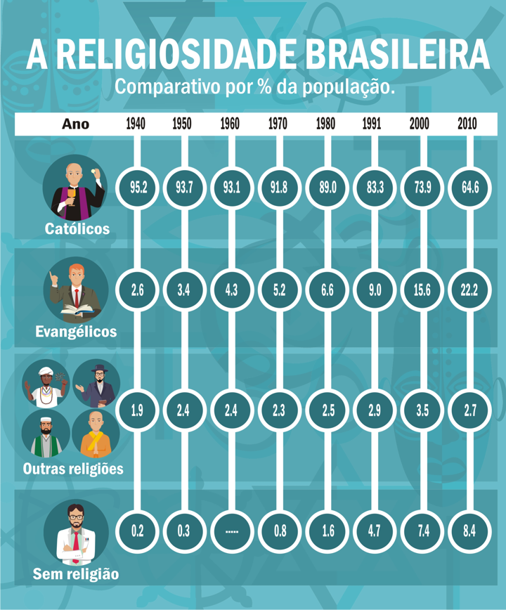
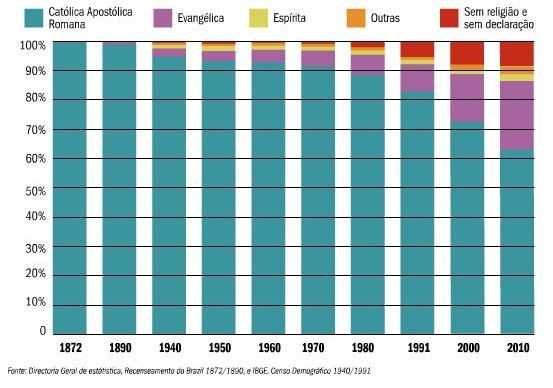

# Tema 5° - RELIGIOSIDADE BRASILEIRA

A religiosidade brasileira é caracterizada por uma diversidade de crenças e práticas religiosas. O texto destaca que mais de 90% dos brasileiros acreditam em Deus ou em uma dimensão transcendente da existência, de acordo com o censo do IBGE. Embora a maioria da população se declare cristã, existem várias outras expressões religiosas no país, como o espiritismo kardecista, a religiosidade afro-brasileira e a influência de crenças e práticas orientais. A religiosidade brasileira é resultado de processos históricos, incluindo o sincretismo e processos de caracterização identitária.

No período colonial, a religião predominante era o catolicismo trazido pelos portugueses, que estabeleceram o tratado conhecido como Padroado, fortalecendo a relação entre o catolicismo romano e as coroas de Portugal e Espanha. No entanto, as religiões indígenas e africanas também desempenharam um papel significativo na formação da religiosidade brasileira, contribuindo para um sincretismo religioso.

O protestantismo chegou ao Brasil no século XIX, com imigrantes europeus que buscavam melhores condições de vida. Inicialmente, enfrentaram restrições devido ao catolicismo oficial do país, mas ao longo do tempo, comunidades protestantes se estabeleceram e pastores de outros países foram enviados ao Brasil. O pentecostalismo, um movimento dentro do protestantismo, surgiu nos Estados Unidos e se espalhou pelo Brasil no início do século XX, trazendo ênfase nos dons do Espírito Santo e celebrações fervorosas.

O movimento pentecostal deu origem ao movimento neopentecostal, que desenvolveu um discurso centrado na cura e na teologia da prosperidade. A Igreja Universal do Reino de Deus se tornou uma das principais representantes desse movimento. O crescimento do pentecostalismo e do neopentecostalismo resultou em mudanças significativas no cenário religioso brasileiro, com uma queda no número absoluto de católicos e um aumento no número de evangélicos.

Além disso, o texto menciona os cultos afro-brasileiros, que surgiram a partir da diáspora africana durante os séculos XVI, XVII e XVIII. Os africanos escravizados no Brasil trouxeram consigo suas tradições religiosas e culturais, e essas tradições foram preservadas e transformadas ao longo do tempo, resultando em religiões afro-brasileiras como o Candomblé e a Umbanda.

Em resumo, a religiosidade brasileira é marcada pela diversidade, com influências do catolicismo, do protestantismo, dos cultos afro-brasileiros e de outras tradições religiosas. Essa diversidade reflete os processos históricos e culturais que moldaram a identidade religiosa do Brasil.

## Images

## Referencias

- [https://sites.google.com/ulbra.br/G000001GS002/t005](https://sites.google.com/ulbra.br/G000001GS002/t005)
- [https://drive.google.com/file/d/1-aDJVG2EtZgTCo9Q78eHDLTs6V7CLBD\_/view](https://drive.google.com/file/d/1-aDJVG2EtZgTCo9Q78eHDLTs6V7CLBD_/view)
