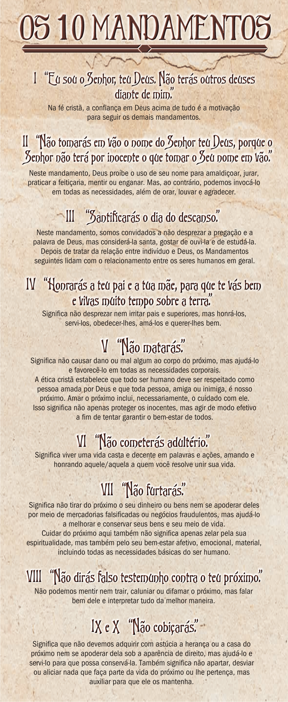

# Tema 6° - REFLEXÕES SOBRE ÉTICA E MORAL

O texto discute reflexões sobre ética e moral. Aborda a capacidade única dos seres humanos de avaliar e julgar suas ações em termos de certo e errado, bom e mau. Explora a importância dos valores éticos e religiosos na tomada de decisões, tanto no nível individual quanto social. Destaca a necessidade de mediar conflitos éticos e religiosos com base no respeito, diálogo e tolerância. Também aborda os desafios éticos trazidos pela tecnologia e discute dilemas contemporâneos, como programação genética, manipulação de embriões e uso sustentável dos recursos naturais. O texto diferencia ética e moral, enfatizando que a ética trata dos princípios e valores que orientam a conduta, enquanto a moral refere-se à prática dessa conduta ética. Explora a importância dos valores, consciência e responsabilidade na formação ética de uma pessoa. Aborda a ética religiosa, que se baseia nos princípios das doutrinas religiosas, e destaca o amor ao próximo como um valor comum a muitas religiões. Especificamente, explora a ética cristã, que se baseia no amor de Deus e enfatiza o amor aos inimigos. Por fim, discute a dança da criação, a queda em pecado e a redenção da humanidade como elementos-chave da ética cristã.

## Ética e moral

“Os latinos tinham uma expressão para “eu” que era ego. E usavam duas para falar de não eu: uma é alter, que significa “o outro”, mas usavam também alius, para indicar “o estranho”. Palavras em português que vêm de alius: “alienado”, “alheio”, “alien”, “alienígena”. Nos filmes de faroeste mais antigos, o nome que se dava para quem não era daquele lugar era “forasteiro”, “estrangeiro”. Aliás, em inglês se usa isso até hoje: stranger ou foreigner. Aquele que não é daqui, aquele que não é como nós, aquele que é, talvez, menos. Visão de alteridade é a capacidade de ver o outro como outro, e não como estranho. Há pessoas que só conseguem olhar o outro como estranho, e não como outro.

(Cortella, 2002, kindle pos. 1172)

## Ética cristã aplicada

### Bioética

A Bioética é uma área específica da ética que promove uma “reflexão interdisciplinar, complexa e compartilhada sobre a adequação de ações que envolvem a vida e o viver” (Goldim, José Roberto [org.]. Bioética e espiritualidade. 2007: p. 11).

Portanto, todas as áreas que se ocupam e se preocupam com a vida e o viver terão alguma participação na discussão bioética. A ética cristã não propõe uma discussão que necessariamente confronte fé e ciência. A fé cristã acredita que a razão humana é obra de Deus e também por meio da ciência Deus continua cuidando de sua criação. Mas sempre que o ser humano ou a própria ciência extrapola os limites dos propósitos de Deus para o ser humano, revelados em sua lei, as consequências normalmente são ruins, especialmente nas questões que envolvem o respeito à vida como uma dádiva de Deus.

DESCARTE E DESTRUIÇÃO DE EMBRIÕES HUMANOS

A vida humana deve ser preservada, pois é obra de Deus. Essa valorização e dignidade se estendem a qualquer estágio de desenvolvimento da vida humana, inclusive o estágio embrionário, logo após a concepção.

O descarte ou destruição consciente de embriões, durante técnicas de reprodução humana assistida ou para fins de pesquisa com células-tronco, na perspectiva da fé cristã, significa eliminação de vidas humanas e, portanto, algo contrário à vontade de Deus.

### Aborto

O mandamento “não matarás” proíbe o homicídio, mas também alerta para a preservação da vida humana, protegendo-a de qualquer perigo ou dano, e evitando a possibilidade de que ela seja tirada ou interrompida. Por isso, a utilização e o consentimento com o uso de qualquer meio que crie situações de risco à vida humana também é condenado por esse mandamento e, assim, torna-se motivo de preocupação bioética numa perspectiva cristã.

Sendo assim, qualquer interrupção, provocada pelo ser humano, do processo de desenvolvimento de uma nova vida criada por Deus é compreendida pela ética cristã como contrária à vontade do Senhor.

Na relação com aqueles que são favoráveis ao aborto é importante registrar que o cristão deve respeitar a decisão pessoal do outro e ajudá-lo a viver da melhor forma possível, especialmente porque o aborto pode gerar inúmeros sentimentos e traumas emocionais. Portanto, mesmo não concordando com o aborto, o cristão irá esmerar-se no cuidado e acolhimento daqueles que eventualmente o praticaram, anunciando a graça do perdão.

### Eutanásia

O termo eutanásia significa literalmente “boa morte”, isto é, abreviar serenamente a vida de quem sofre doença incurável, interrompendo o sofrimento. Há diferentes tipos de eutanásia: ativa, passiva, voluntária, involuntária etc. Não há como aprofundarmos o tema nesta breve exposição, mas cabe o desafio da pesquisa adicional.

A ética cristã é contra a eutanásia, pois interromper uma vida, ainda que com o propósito de abreviar o sofrimento, é assumir uma autoridade que pertence exclusivamente a Deus que nos dá a própria vida.

O tema da eutanásia é complexo, mas provoca outra discussão importante sob a perspectiva ética cristã, que também pode ser aplicada à questão do aborto, que é o perigo de, sob a alegação de abreviar ou evitar o sofrimento, criar uma sociedade disposta a descartar ou eliminar vidas humanas para isso, acabando por estabelecer a sobrevivência ou permanência apenas daquelas vidas humanas que não representam motivo de sofrimento, para si mesmos ou para outros.

### Pena de morte

A pena de morte é um tema polêmico e sempre presente nas discussões sobre ética aplicada. Há argumentos importantes tanto por parte daqueles que são a favor da aplicação e legalização da pena de morte quanto daqueles que são contrários à aplicação da pena capital.

Em geral, a ética cristã reconhece a pena de morte como um instrumento que pode ser usado pela autoridade constituída para combater e punir o mal, conforme a própria Bíblia ensina. Mas a necessidade ou a eficácia de se utilizar a pena de morte como meio para isso não é unanimidade entre os cristãos. Muitos, inclusive, posicionam-se de forma contrária, por entender que Deus é o Senhor da vida e da morte e que, mesmo criminosos são alvos do amor de Deus e merecem ser vistos como “o nosso próximo”, sendo que por eles devemos também zelar.

### Sustentabilidade

A ética cristã entende que toda vida na terra é criação divina e compete aos seres humanos conservá-la. Buscar a preservação e utilização adequada dos recursos naturais é uma manifestação do amor a Deus, às outras criaturas e à própria criação. No reconhecimento do Criador, a ética cristã desperta para a responsabilidade e o compromisso com a criação como preciosa dádiva de Deus, pois a Bíblia diz que tudo que Deus criou é bom. Sendo assim, passa-se a buscar o uso conveniente da criação para sustento de toda a vida, o equilíbrio entre o uso e o abuso, um ser humano consciente de sua relação com o Criador e assim administrador das dádivas divinas, esforçando-se no controle da maldade e cobiça humana que é a grande ameaça ao mundo abençoado por Deus.

A sustentabilidade só é possível se mudar a forma de ser, pensar e agir do ser humano. Por isso, a utilização correta dos recursos naturais e o combate ao desperdício e à destruição do meio ambiente, para o cristão, não dependem de políticas públicas apenas, mas inicia pela mudança consciente de seus próprios hábitos e práticas, pois se sente corresponsável pela criação como consequência do amor e perdão recebidos do próprio Deus Criador.

## Images

## Referencias

- [https://sites.google.com/ulbra.br/G000001GS002/t006](https://sites.google.com/ulbra.br/G000001GS002/t006)
- [https://www.youtube.com/watch?v=bsyeLOhtkX8&ab_channel=Bellereads](https://www.youtube.com/watch?v=bsyeLOhtkX8&ab_channel=Bellereads)
- [https://www.youtube.com/watch?v=5oIs8fFiGn0&ab_channel=DECIFRANDOOVERBO](https://www.youtube.com/watch?v=5oIs8fFiGn0&ab_channel=DECIFRANDOOVERBO)
