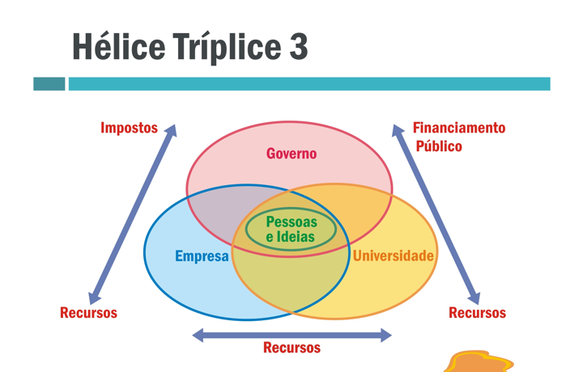

# Tema 3° - A INOVAÇÃO COMO FERRAMENTA PARA O SUCESSO

## Principais pontos abordados no tema

- O artigo aborda a importância da inovação como ferramenta para o sucesso.
- São mencionados três principais pontos a serem aprendidos nesta unidade temática: identificar oportunidades de inovação, conhecer a legislação relacionada à inovação e analisar criticamente o processo de inovação em diferentes segmentos profissionais.
- São discutidos conceitos e processos de inovação, incluindo a geração de ideias inovadoras e os três passos principais para dar continuidade à criação.
- É apresentado o modelo da tríplice hélice (Universidade, Indústria e Governo) como forma de promover a inovação e trazer benefícios para a sociedade.
- São abordados tipos de inovação, como incremental e radical, e a importância de ferramentas como o Diagrama de Pareto e o brainstorm para o processo de inovação.
- São destacados os pontos em comum e as diferenças entre marcas e patentes, bem como a importância do registro desses direitos de propriedade intelectual.
- É mencionada a lei de incentivo à inovação e à tecnologia como uma forma de estimular parcerias entre universidades, institutos tecnológicos e empresas, e promover a inovação no âmbito empresarial.

## Entendendo a inovação

### Inovação Incremental:

É aquela que possui grau moderado de novidade, mas ainda proporciona ganhos significativos. Ocorre continuamente em uma indústria e se constitui de ajustes em produtos e processos existentes.

### Inovação Radical:

É aquela que provoca transformações nas regras competitivas, no processo produtivo, nos produtos e nos serviços.

## Tipos de inovação

### Inovação de serviços:

Quando a empresa cria um sistema de autoatendimento. Um sistema novo, proporcionando uma nova maneira de se relacionar com o cliente.

### Inovação de produtos:

Quando é criado um produto novo, que traga algum benefício para o usuário, cliente.

### Inovação de processos:

Quando há a implementação de uma função inovadora no processo, como, por exemplo, um controle novo de fluxo de processo, que garanta a redução de custo ou de prazo, acelerando um atendimento, facilitando os processos internos.

### Inovação de Marketing:

Quando se cria, por exemplo, uma embalagem, agregando valor significativamente. Seria como criar uma embalagem mais adequada para algum produto e que facilite o consumo por parte do cliente.

### Inovação Organizacional:

Quando a empresa desenvolve parcerias com outras organizações, o uso de uma nova técnica de realizar uma reunião, por exemplo, aproximando os parceiros de negócios.

## Legislação sobre registro de marcas e patentes

### Marca:

tipos de sinais marcários, distintivos ou princípios legais que regem o direito de marcas e modalidades de busca. Pode ser classificada quanto à sua origem como brasileira e estrangeira. Quanto ao seu uso pode ser de produtos, de serviços, coletivas e de certificação. E quanto à apresentação ela pode ser Nominativa, Figurativa, Mista e Tridimensional.

### Patente:

Se você inventou uma nova tecnologia, seja para produto ou processo, pode buscar o direito a uma patente. A patente também vale para melhorias no uso ou fabricação de objetos de uso prático, como utensílios e ferramentas. Ela pode ser uma Patente de Invenção (PI) ou Patente de Modelo de Utilidade (MU).

## Leis de incentivo à inovação e à tecnologia

### Parques tecnológicos

Constituem um complexo produtivo industrial e de serviços de base científico-tecnológica. Planejados, têm caráter formal, concentrado e cooperativo, agregando empresas cuja produção se baseia em P&D. Assim, os parques atuam como promotores da cultura da inovação, da competitividade e da capacitação empresarial, fundamentados na transferência de conhecimento e tecnologia, com o objetivo de incrementar a produção de riqueza de uma determinada região.

### Aceleradoras

São entidades jurídicas (com ou sem fins lucrativos) dedicadas a apoiar o desenvolvimento inicial de novos negócios inovadores (startups), por meio de um processo estruturado, com tempo determinado, que inclui a seleção, capacitação, mentorias, oportunidades de acesso a mercados, infraestrutura e serviços de apoio, além do aporte de capital financeiro inicial (próprio ou de sua rede de investidores), em troca de uma possível participação societária futura nos negócios acelerados.”

### Coworking

É um modelo de trabalho que se baseia no compartilhamento de espaço e recursos de escritório, reunindo pessoas que trabalham não necessariamente para a mesma empresa ou na mesma área de atuação, podendo reunir entre os seus usuários os profissionais liberais, empreendedores e usuários independentes. É uma alternativa para aumentar a produtividade e fazer novos contatos de negócios através do networking. Pessoas e empresas usuárias de coworkings também utilizam este modelo de trabalho para estabelecer relacionamentos de negócios onde oferecem e/ou contratam serviços mutuamente. Alguns destes relacionamentos também visam favorecer o surgimento e o amadurecimento de ideias e projetos em grupo.

### Instituições científicas e tecnológicas (ICTs)

Em seu conceito mais amplo, envolvem universidades e institutos de pesquisa públicos e privados que tenham como missão institucional, dentre outras, executar atividades de pesquisa básica ou aplicada de caráter científico ou tecnológico.

### Programas de aceleração

Podem ter processos estruturados de capacitação, mentorias e, eventualmente, mecanismos de acesso a mercados. Essas iniciativas diferenciam-se das aceleradoras, principalmente pelo fato de serem conduzidas por entidades que não são pessoas jurídicas dedicadas ao processo de aceleração, por não investirem diretamente nas startups e, consequentemente, por não assumirem participação societária nessas empresas nascentes.

## Imagens

## Referências

- [https://sites.google.com/ulbra.br/G000004GS003/t003](https://sites.google.com/ulbra.br/G000004GS003/t003)
