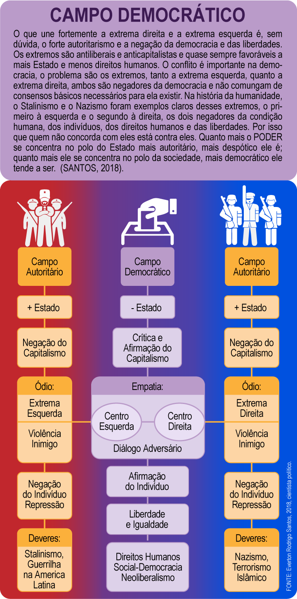
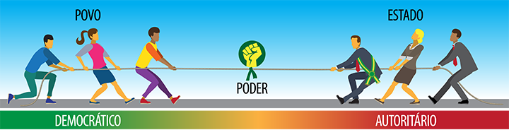
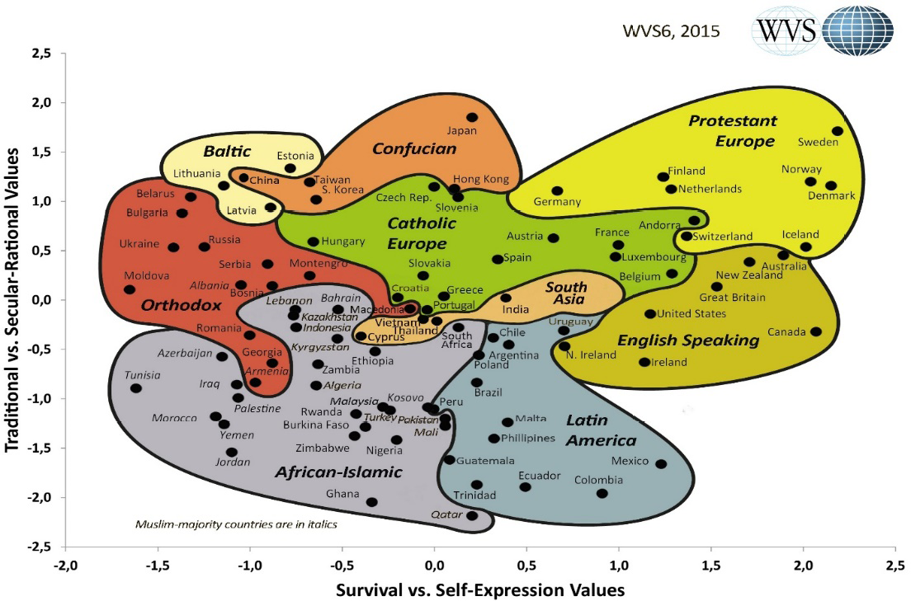
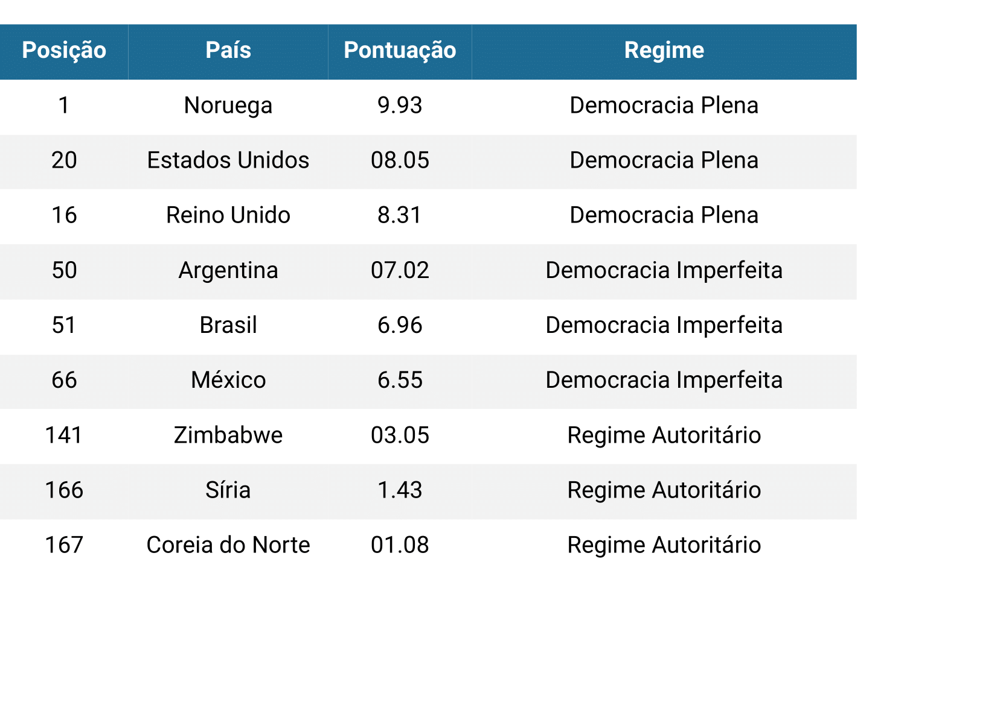
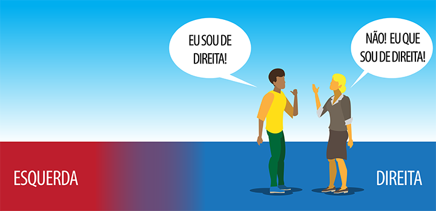

# Tema 3° - DEMOCRACIA REPRESENTATIVA LIBERAL: PRINCÍPIOS E PRESSUPOSTOS

O texto aborda os princípios e pressupostos da democracia representativa liberal, bem como a relação entre democracia e direitos humanos. O autor destaca que, para o senso comum, a defesa dos direitos humanos é frequentemente associada à defesa de criminosos, o que gera uma simplificação e polarização no debate. O objetivo do texto é fornecer referenciais para uma reflexão mais sofisticada sobre os conceitos de democracia e direitos humanos, situando-os teórica e historicamente. O autor menciona que a democracia tem suas raízes na Grécia Antiga, onde o poder era do povo, e destaca a importância de distribuir o poder e regular a competição política por meio de regras. Na democracia moderna representativa, surgiu o desafio da representação política, diferentemente da democracia direta dos gregos. O autor também menciona eventos históricos, como a Carta Magna na Inglaterra e a Revolução Francesa, que contribuíram para a consolidação dos direitos fundamentais contra o arbítrio estatal.

O texto discute a relação entre riqueza, democracia e posicionamento político. O autor destaca que a riqueza não cria automaticamente a democracia, mas sua existência prolongada pode favorecê-la. O cientista político Ronald Inglehart argumenta que o crescimento econômico não leva diretamente à democracia, pois, em estágios iniciais do desenvolvimento capitalista, as pessoas têm valores mais materialistas, preocupando-se principalmente com sua sobrevivência e condições de vida. A democracia requer valores pós-materialistas, como autoexpressão e participação cívica. O autor apresenta um gráfico que ilustra países mais pós-materialistas à direita, como a Suécia, e mais materialistas à esquerda, como Marrocos.

O texto destaca que a democracia precisa de forças de oposição e resistência fora do governo, como uma classe média educada e participativa com valores pós-materialistas. Essa oposição não se estabelece rapidamente, exigindo tempo para que os valores sejam internalizados pela cultura e pela sociedade. Ser situação (governo) ou oposição não está necessariamente ligado à posição de esquerda ou direita na política, mas sim a uma dinâmica de poder. O autor menciona que a terminologia de esquerda e direita originou-se na Revolução Francesa, relacionando-se à sensibilidade para questões sociais e econômicas, respectivamente.

A discussão também aborda a relação com o Estado e suas atribuições. A esquerda é associada a um Estado mais voltado ao desenvolvimento social, à distribuição de renda e a políticas sociais, enquanto a direita concebe um Estado mais voltado para a eficiência econômica e o controle dos gastos públicos. O autor menciona que, em todo o mundo, os mais ricos tendem a votar mais na direita. No contexto brasileiro, as regiões mais carentes votam no Partido dos Trabalhadores (PT), identificado com valores de esquerda, enquanto os mais ricos votam no Partido da Social Democracia Brasileira (PSDB) e, nas últimas eleições, no Partido Social Liberal (PSL), de extrema-direita.

O texto enfatiza que pessoas com maior renda têm menos dependência do Estado, pois possuem recursos para atender suas necessidades básicas por meio de serviços privados. Já as populações carentes dependem mais dos serviços públicos como única alternativa de sobrevivência. O autor ressalta que isso não impede que pessoas mais abastadas possam votar em partidos de esquerda por motivações como solidariedade ou sensibilidade social, mas destaca que esse não é o padrão de comportamento do eleitor. Ele também menciona a existência de extremos políticos tanto à esquerda quanto à direita, que são negadores da democracia e não compartilham consensos necessários para sua existência.

O cientista político Norberto Bobbio é citado para explicar a diferença entre esquerda e direita. Bobbio argumenta que a ideia de igualdade é o que separa a esquerda da direita. As pessoas são ao mesmo tempo iguais e diferentes, e a esquerda enfatiza a igualdade, enquanto a direita destaca as diferenças. O texto conclui que tanto a centro-esquerda quanto a centro-direita são forças comprometidas com a democracia, regras políticas e leis, enquanto os extremos políticos são antiliberais, anticapitalistas e negadores da democracia e das liberdades. O autor afirma que ser de esquerda ou direita é uma questão relacional e destaca exemplos como Barack Obama, posicionado mais à esquerda nos Estados Unidos, e Donald Trump, posicionado à direita.

## A democracia em terras brasileiras

Uma sociedade só é democrática quando ninguém for tão rico que possa comprar alguém e ninguém seja tão pobre que tenha de se vender a alguém.
Jean-Jacques Rousseau

## Images

## Referencias

- [https://sites.google.com/ulbra.br/G000003GS002/t003](https://sites.google.com/ulbra.br/G000003GS002/t003)
- [https://www.youtube.com/watch?v=\_5Fy4FaxE7s&ab_channel=CanalCurta%21](https://www.youtube.com/watch?v=_5Fy4FaxE7s&ab_channel=CanalCurta%21)
- [https://docs.google.com/presentation/d/1Gphv-NaLJqkruRw9vkD2c9mOoGyCsRNa1qqfe3b0z0g/present?slide=id.p1](https://docs.google.com/presentation/d/1Gphv-NaLJqkruRw9vkD2c9mOoGyCsRNa1qqfe3b0z0g/present?slide=id.p1)
