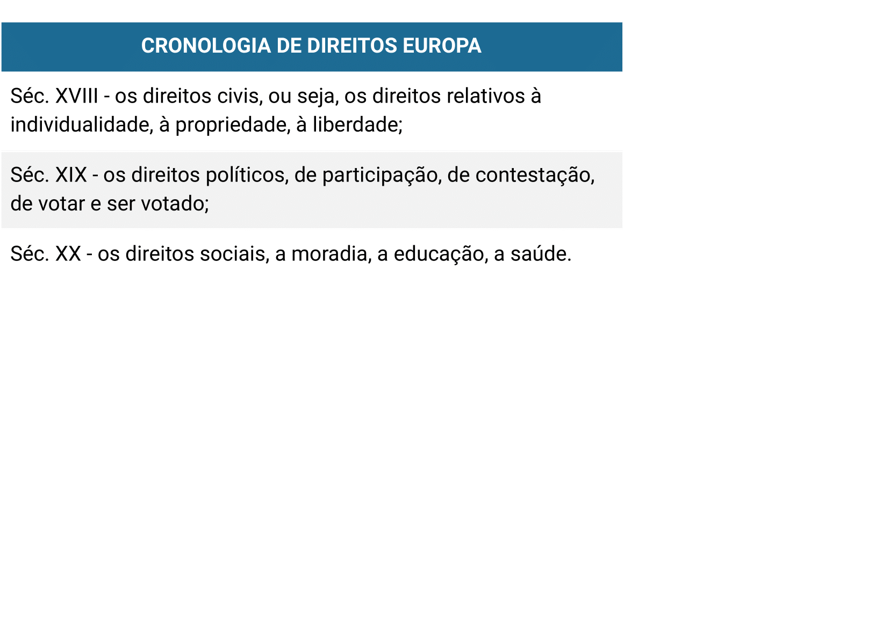

# Tema 4° - CULTURA BRASILEIRA, AUTORITARISMO E DIREITOS HUMANOS

O texto aborda a relação entre cultura brasileira, autoritarismo e direitos humanos. Ele destaca a importância dos direitos humanos na democracia, ressaltando que a violação desses direitos é uma violação da própria sociedade. O texto explora a definição de direitos humanos como direitos fundamentais universais e históricos, que evoluem ao longo do tempo.

No contexto brasileiro, o texto argumenta que o país tem um histórico de violação dos direitos humanos devido a várias razões históricas, sociais e políticas. Afirma-se que o Brasil nasceu sob a égide da escravidão e do patriarcalismo machista, o que influenciou sua cultura política. O texto menciona que o desenvolvimento histórico do Brasil não favoreceu a afirmação dos direitos civis, políticos e sociais na ordem proposta por Marshall, destacando que a cidadania no Brasil foi construída de forma invertida, com os direitos sociais vindo antes dos direitos políticos e civis.

Essa inversão na sequência dos direitos teria levado a uma cidadania passiva no Brasil, fortalecendo o poder executivo em detrimento de outras instituições e enfraquecendo as dinâmicas de pressão da sociedade sobre o Estado. O texto sugere que essa herança histórica teve implicações significativas no final do século XX, quando as reformas constitucionais exigiram uma nova dinâmica da sociedade brasileira.

O texto levanta questões sobre a relação entre a defesa dos direitos humanos e a defesa dos interesses individuais, a distribuição de renda e a evolução dos direitos humanos. Também destaca o papel das novas tecnologias de comunicação e informação na crise do modelo de democracia representativa liberal e explora a relação entre liberdade e segurança no contexto atual.

## DEMOCRACiÔMETRO

Vamos testar o seu senso de democracia? Basta responder o questionário neste link, anotar a pontuação obtida e comparar com as classificações abaixo:

DEMOCRACIA PLENA – entre 88 e 121 pontos

DEMOCRACIA IMPERFEITA – entre 26 a 88 pontos

REGIME HÍBRIDO – entre 7 e 26 pontos

REGIME AUTORITÁRIO – até 7 pontos

## Images

## Referencias

- [https://sites.google.com/ulbra.br/G000003GS002/t004](https://sites.google.com/ulbra.br/G000003GS002/t004)
