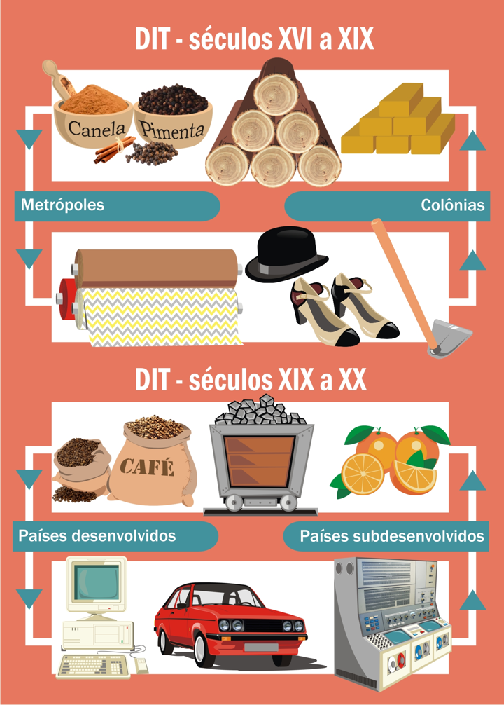

# Tema 6° - TRABALHO E EMPREGO NO MUNDO DAS NOVAS TECNOLOGIAS

O capítulo discute o trabalho e o emprego no mundo das novas tecnologias, apresentando as condições de empregabilidade nesse contexto. Ele aborda a transição para uma economia baseada no conhecimento e no avanço tecnológico como impulsionadores do desenvolvimento. O texto descreve a história econômica do Brasil, desde a exploração de recursos naturais até a industrialização, e discute a nova divisão internacional do trabalho entre países produtores de conhecimento e consumidores de tecnologia. As mudanças políticas, econômicas e tecnológicas que ocorreram no final do século XX são apresentadas como tendo criado um mundo mais conectado e exigente, onde o conhecimento e a comunicação desempenham um papel fundamental na criação de riqueza. O capítulo também enfatiza a necessidade de redefinir carreiras e a importância do planejamento e da gestão de carreira para os profissionais do século XXI.

As "carreiras sem fronteiras" oferecem diversos benefícios para os indivíduos que as seguem, como autonomia e auto-organização em relação aos horários e dias de trabalho, acumulação de conhecimento em diferentes organizações, maiores ganhos financeiros, maior tolerância, adaptabilidade e flexibilidade, aumento do status e respeito profissional, e relacionamentos mais horizontais dentro das organizações. Já as organizações também se beneficiam dessas carreiras, pois têm acesso a quadros mais qualificados e experientes, funcionários mais motivados devido aos maiores ganhos, e a possibilidade de reter parte do conhecimento e experiência dos indivíduos mesmo quando eles deixam a organização. Além disso, a contratação de profissionais com carreiras sem fronteiras pode resultar em economia na qualificação de funcionários, uma vez que eles muitas vezes já entram na organização com habilidades e conhecimentos avançados. Essas carreiras têm se consolidado no contexto da economia do conhecimento e tendem a ultrapassar as fronteiras organizacionais e nacionais, expandindo-se além dos limites continentais e intercontinentais de empregabilidade.

Na gestão de carreira no século XXI, as responsabilidades de planejamento e gestão recaem sobre os indivíduos, em vez de serem atribuídas às organizações, o que representa uma mudança em relação à tradição brasileira de deixar as empresas planejarem as carreiras. Na economia do conhecimento, todos trabalham de forma autônoma e empreendedora, a menos que escolham carreiras altamente estruturadas através de concursos públicos. Mesmo nesses casos, há espaço para autonomia, como pessoas que realizam vários concursos antes de alcançar o desejado. O empreendedorismo na atualidade está ligado às profissões do presente e futuro, e não apenas a abrir um negócio próprio. É necessário investir na carreira e desenvolver uma estratégia de carreira.

Uma estratégia de carreira envolve tomar decisões conscientes e escolher caminhos para alcançar objetivos profissionais. É fundamental desenvolver competências relevantes para o mercado de trabalho, como conhecimento, habilidade e atitude. As empresas valorizam diferentes tipos de conhecimentos, habilidades e atitudes, mas algumas competências são importantes independentemente da organização, como motivação, equilíbrio emocional, atitudes inovadoras, pensamento crítico e criatividade. É necessário traçar um plano de ação para a carreira, baseado em decisões pensadas, a fim de aumentar as chances de sucesso profissional.

Em suma, é importante refletir sobre as carreiras sem fronteiras e compreender como elas podem oferecer benefícios tanto para os indivíduos como para as organizações. Além disso, é fundamental assumir a responsabilidade pelo planejamento e gestão da própria carreira, desenvolvendo competências relevantes e traçando estratégias para alcançar os objetivos profissionais.

## Empregabilidade na era da economia do conhecimento

### carreiras organizacionais

- ambiente estável e dinâmico;
- economia subordinada às grandes firmas que geram oportunidades de emprego;
- mudanças nas firmas geram mudanças de carreiras;
- há interdependência entre empresa e pessoa;
- as empresas oferecem carreiras para toda a vida;
- o empreendimento é uma opção e não um elemento necessário;
- os empregados são parte da organização;
- a carreira é predeterminada pela empresa e não pelo indivíduo.

### carreiras sem fronteiras

- ter a pessoa como principal responsável pela carreira;
- apresentar condições de mobilidade por meio de fronteiras organizacionais e valor do trabalho, independentemente do empregador;
- ser subsidiada por informações sobre o mercado de trabalho e redes de relacionamento (networks, capital social);
- reconhecer formas de progressão e de continuidade independentemente da hierarquia organizacional, bem como ser permeada pela conciliação entre necessidades profissionais, pessoais e familiares;
- ter condições de se organizar por meio do indivíduo e não somente mediante possibilidades oferecidas pela organização;
- reconhecer possibilidades de atuação em pequenos projetos;
- considerar a aprendizagem como fator para o desenvolvimento profissional e para a continuidade da carreira;
- ter a ação e participação não contratual como elementos essenciais ao seu desenvolvimento.

### O que pode ganhar uma pessoa com essa modalidade de carreira?

autonomia e auto-organização na composição de seus horários e dias de trabalho;

conhecimento acumulado em diferentes organizações;

ganhos maiores na composição da renda final;

tolerância, adaptabilidade, flexibilidade;

status e respeitabilidade profissional são ampliadas;

relacionamentos mais horizontalizados dentro das próprias organizações.

### O que pode ganhar uma organização com essa carreira:

quadros mais qualificados, com experiências diversificadas;

quadros mais motivados devido aos ganhos maiores;

conhecimento, pois quando o indivíduo deixar a organização, parte do seu conhecimento ficará;

experiência, pois ao se mover entre organizações, o indivíduo leva o benefício de sua experiência para outro cenário;

economia na qualificação de quadros que muitas vezes já entram na organização altamente capitalizados.

## Images

## Referencias

- [https://sites.google.com/ulbra.br/G000003GS002/t006](https://sites.google.com/ulbra.br/G000003GS002/t006)
